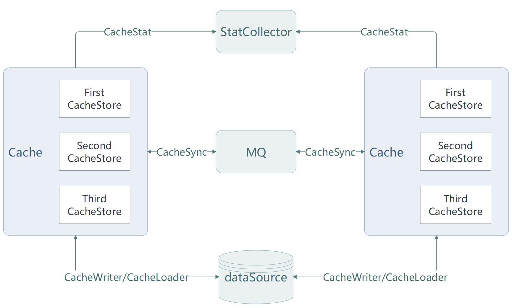

# Xcache

[](https://www.apache.org/licenses/LICENSE-2.0.html) [](https://github.com/patricklaux/xcache/releases) [](https://central.sonatype.com/namespace/com.igeeksky.xcache) [](https://github.com/patricklaux/xcache/commits)

## 简介

Xcache 是易于扩展、功能强大且配置灵活的 Java 多级缓存框架。

## 架构



## 特性

- 支持多种缓存模式：Cache-Aside，Read-Through，Write-Through，Write-Behind。
- 支持缓存数据同步：通过缓存事件广播，多个应用实例的缓存数据保持一致。
- 支持缓存指标统计：通过日志方式输出和 Redis Stream 方式输出，便于统计各种缓存指标。
- 支持缓存自动刷新：自动刷新缓存数据，避免慢查询导致应用响应缓慢。
- 支持数据回源加锁：加锁确保相同的键同时仅有一个线程回源查询，降低回源次数，减轻数据源压力。
- 支持缓存数据压缩：通过压缩数据，降低内存消耗。
- 支持多级缓存实现：内嵌缓存采用 Caffeine，外部缓存采用 Redis，并可通过实现 Store 接口扩展缓存能力，最多可支持三级缓存。
- 适配 SpringCache：无需修改现有代码，引入 Xcache 依赖，即可支持更多缓存功能配置。
- 更强大的缓存注解：Cacheable，CacheableAll，CachePut，CachePutAll，CacheEvict，CacheEvictAll，CacheClear
- 数据存在断言：通过实现数据存在断言接口，譬如 Bloom Filter，避免回源查询。
- 支持缓存空值：当数据源确定无数据时，可缓存空值，避免缓存穿透。
- 虚拟线程优化：需要加锁执行或 IO 等待的定时任务，采用虚拟线程执行，降低平台线程资源占用。

## 使用

### 运行环境

SpringBoot：[3.3.0, )
JDK：21

### 基本使用

**参考项目**：[xcache-samples-base](https://github.com/patricklaux/xcache-samples/tree/main/xcache-samples-base)

#### Maven 依赖

如果不使用缓存注解，直接通过代码调用的方式操作缓存，仅需引入 ``xcache-spring-boot-starter`` 。

```xml
<dependencies>
    <dependency>
        <groupId>com.igeeksky.xcache</groupId>
        <artifactId>xcache-spring-boot-starter</artifactId>
        <version>${xcache.version}</version>
    </dependency>
    <!-- ... other ... -->
</dependencies>
```

主要依赖组件

- 内嵌缓存：Caffeine
- Redis 客户端：Lettuce
- 数据序列化：Jackson

#### 代码示例

```java
public class UserCacheService {

    private final UserDao userDao;
    private final Cache<Long, User> cache;
    private final CacheLoader<Long, User> cacheLoader;

    public UserCacheService(UserDao userDao, CacheManager cacheManager) {
        this.userDao = userDao;
        this.cache = cacheManager.getOrCreateCache("user", Long.class, User.class);
        this.cacheLoader = new UserCacheLoader(this.userDao);
    }

    /**
     * 根据用户ID获取单个用户信息
     *
     * @param id 用户ID
     */
    public User getUser(Long id) {
        return cache.get(id, cacheLoader);
    }

    /**
     * 根据用户ID批量获取用户信息
     *
     * @param ids 用户ID集合
     */
    public Map<Long, User> getUsers(Set<Long> ids) {
        return cache.getAll(ids, this.cacheLoader);
    }

    /**
     * 新增用户
     *
     * @param user 用户信息
     */
    public User saveUser(User user) {
        User created = userDao.save(user);
        cache.put(user.getId(), created);
        return created;
    }

    /**
     * 更新用户信息
     *
     * @param user 用户信息
     */
    public User updateUser(User user) {
        User updated = userDao.update(user);
        cache.put(user.getId(), updated);
        return updated;
    }

    /**
     * 批量更新用户信息
     *
     * @param users 用户信息集合
     */
    public Map<Long, User> updateUsers(List<User> users) {
        Map<Long, User> updates = userDao.batchUpdate(users);
        cache.putAll(updates);
        return updates;
    }

    /**
     * 删除用户信息
     *
     * @param id 用户ID
     */
    public void deleteUser(Long id) {
        userDao.delete(id);
        cache.evict(id);
    }

    /**
     * 批量删除用户信息
     *
     * @param ids 用户ID集合
     */
    public void deleteUsers(Set<Long> ids) {
        userDao.batchDelete(ids);
        cache.evictAll(ids);
    }

    /**
     * 清空数据
     */
    public void clear() {
        userDao.clear();
        cache.clear();
    }

    /**
     * 内部类实现 CacheLoader
     *
     * @param userDao
     */
    private record UserCacheLoader(UserDao userDao) implements CacheLoader<Long, User> {

        @Override
        public User load(Long id) {
            return this.userDao.findUser(id);
        }

        @Override
        public Map<Long, User> loadAll(Set<? extends Long> ids) {
            return this.userDao.findUserList(ids);
        }

    }

}
```

### Xcache 注解

**参考项目**：[xcache-samples-annotation](https://github.com/patricklaux/xcache-samples/tree/main/xcache-samples-annotation)

#### Maven 依赖

如果希望使用 xcache 自定义注解，除了 ``xcache-spring-boot-starter`` 外，还需引入 ``xcache-spring-aop`` 。

```xml
<dependencies>
    <dependency>
        <groupId>com.igeeksky.xcache</groupId>
        <artifactId>xcache-spring-boot-starter</artifactId>
        <version>${xcache.version}</version>
    </dependency>
    <dependency>
        <groupId>com.igeeksky.xcache</groupId>
        <artifactId>xcache-spring-aop</artifactId>
        <version>${xcache.version}</version>
    </dependency>
    <!-- ... other ... -->
</dependencies>
```

#### 代码示例

```java
/**
 * 用户缓存服务
 */
@Service
@CacheConfig(name = "user", keyType = Long.class, valueType = User.class)
public class UserCacheService {

    private final static Logger log = LoggerFactory.getLogger(UserCacheService.class);

    private final UserDao userDao;

    public UserCacheService(UserDao userDao) {
        this.userDao = userDao;
    }

    /**
     * 获取单个用户信息
     * 
     * Cacheable 注解，对应 V value = cache.get(K key, CacheLoader<K,V> loader) 方法。
     * 
     * 如未配置 key 表达式，采用方法的第一个参数作为缓存键；如已配置 key 表达式，解析该表达式提取键.
     *
     * @param id 用户ID
     * @return User – 用户信息
     */
    @Cacheable
    public User getUser(Long id) {
        return userDao.findUser(id);
    }

    /**
     * 获取单个用户信息
     *
     * @param id 用户ID
     * @return Optional<User> – 用户信息
     * 如检测到方法返回值类型为 Optional，缓存实现会自动采用 Optional.ofNullable() 包装返回值.
     */
    @Cacheable
    public Optional<User> getOptionalUser(Long id) {
        User user = userDao.findUser(id);

        // if (user == null) {
        //     错误：方法返回值为 Optional 类型时，不建议直接返回 null
        //     方法返回 null，缓存实现则用 Optional.ofNullable(value) 包装返回值，两者结果将不一致
        //     return null;
        // } else {
        //     return Optional.of(user);
        // }

        // 正确：使用 Optional.ofNullable(value) 包装可能为空的值
        return Optional.ofNullable(user);
    }

    /**
     * 获取单个用户信息
     *
     * @param id 用户ID
     * @return CompletableFuture<User> – 用户信息
     * 如检测到方法返回值类型为 CompletableFuture，缓存实现会自动采用 CompletableFuture.completedFuture() 包装返回值.
     */
    @Cacheable
    public CompletableFuture<User> getFutureUser(Long id) {
        User user = userDao.findUser(id);

        // if (user == null) {
        //     错误：方法返回值为 CompletableFuture 类型时，不建议直接返回 null
        //     方法返回 null，缓存实现则用 CompletableFuture.completedFuture(value) 包装返回值，两者结果将不一致
        //     return null;
        // } else {
        //     return CompletableFuture.completedFuture(user);
        // }

        // 正确：使用 CompletableFuture.completedFuture 包装可能为空的值
        return CompletableFuture.completedFuture(user);
    }

    /**
     * 批量获取用户信息
     * 
     * CacheableAll 注解，对应 Map<K,V> results = cache.getAll(Set<K> keys, CacheLoader<K,V> loader) 方法.
     * 缓存的键集：Set 类型。如未配置 keys 表达式，采用方法的第一个参数作为键集；如已配置 keys 表达式，解析该表达式提取键集.
     * 缓存结果集：Map 类型.
     *
     * @param ids 用户ID集合
     * @return Map<Long, User> – 用户信息集合
     */
    @CacheableAll
    public Map<Long, User> getUsers(Set<Long> ids) {
        log.debug("getUsers: {}", ids);
        return userDao.findUserList(ids);
    }

    /**
     * 批量获取用户信息
     *
     * @param ids 用户ID集合
     * @return Optional<Map<Long, User>> – 用户信息集合 
     * 如检测到方法返回值类型为 Optional，缓存实现会自动采用 Optional.ofNullable() 包装返回值.
     */
    @CacheableAll
    public Optional<Map<Long, User>> getOptionalUsers(Set<Long> ids) {
        log.debug("getOptionalUsers: {}", ids);
        return Optional.ofNullable(userDao.findUserList(ids));
    }

    /**
     * 批量获取用户信息
     *
     * @param ids 用户ID集合
     * @return CompletableFuture<Map<Long, User>> – 用户信息集合
     * 如检测到方法返回值类型为 CompletableFuture，缓存实现会自动采用 CompletableFuture.completedFuture() 包装返回值.
     */
    @CacheableAll(keys = "#ids")
    public CompletableFuture<Map<Long, User>> getFutureUsers(Set<Long> ids) {
        log.debug("getFutureUsers: {}", ids);
        return CompletableFuture.completedFuture(userDao.findUserList(ids));
    }

    /**
     * 新增用户信息
     * 
     * CachePut 注解，对应 cache.put(K key, V value) 方法.
     * 如未配置 key 表达式，采用方法的第一个参数作为缓存键；如已配置 key 表达式，解析该表达式提取键.
     * 如未配置 value 表达式，采用方法返回结果作为缓存值；如已配置 value 表达式，解析该表达式提取值.
     *
     * @param user 用户信息（无ID）
     * @return User – 用户信息（有ID）
     */
    @CachePut(key = "#result.id")
    public User saveUser(User user) {
        return userDao.save(user);
    }

    /**
     * 更新用户信息
     *
     * @param user 用户信息
     * @return User – 用户信息
     */
    @CachePut(key = "#user.id", value = "#user")
    public User updateUser(User user) {
        return userDao.update(user);
    }

    /**
     * 批量更新用户信息
     * 
     * CachePutAll 注解， 对应 cache.putAll(Map<K,V> keyValues) 方法.
     * 如未配置 keyValues 表达式，默认采用方法返回值；如已配置 keyValues 表达式，解析该表达式提取键值对集合.
     *
     * @param users 用户信息列表
     * @return Map<Long, User> – 用户信息集合
     */
    @CachePutAll
    public Map<Long, User> updateUsers(List<User> users) {
        return userDao.batchUpdate(users);
    }

    /**
     * 删除用户信息
     * <p>
     * CacheEvict 注解，对应 cache.evict(K key) 方法.
     *
     * @param id 用户ID
     */
    @CacheEvict
    public void deleteUser(Long id) {
        userDao.delete(id);
    }

    /**
     * 批量删除用户信息
     *
     * CacheEvictAll 注解，对应 cache.evictAll(Set<K> keys) 方法.
     *
     * @param ids 用户ID集合
     */
    @CacheEvictAll
    public void deleteUsers(Set<Long> ids) {
        userDao.batchDelete(ids);
    }

    /**
     * 清空数据
     * 
     * CacheClear 注解，对应 cache.clear() 方法.
     */
    @CacheClear
    public void clear() {
        userDao.clear();
    }

}
```


### Spring Cache  注解

**参考项目**：[xcache-samples-spring-annotation](https://github.com/patricklaux/xcache-samples/tree/main/xcache-samples-spring-annotation)

#### Maven 依赖

如希望使用 Spring Cache 及其注解，除了 ``xcache-spring-boot-starter`` 外，还需引入 ``xcache-spring-adapter-autoconfigure`` 。

```xml
<dependencies>
    <dependency>
        <groupId>com.igeeksky.xcache</groupId>
        <artifactId>xcache-spring-boot-starter</artifactId>
        <version>${xcache.version}</version>
    </dependency>
    <dependency>
        <groupId>com.igeeksky.xcache</groupId>
        <artifactId>xcache-spring-adapter-autoconfigure</artifactId>
        <version>${xcache.version}</version>
    </dependency>
    <!-- ... other ... -->
</dependencies>
```

#### 代码示例

```java
/**
 * 用户缓存服务
 * 
 * Spring Cache 没有 CacheableAll、CachePutAll、CacheEvictAll 这三个注解. 
 * Xcache 完整实现了 Spring cache 接口，因此正常使用 Spring cache 注解即可，并无特别限制. 
 * Xcache 适配 Spring cache 的 cacheManager 为 springCacheManager ，如无其它 cacheManager，可以不指定.
 */
@Service
@CacheConfig(cacheNames = "user", cacheManager = "springCacheManager")
public class UserCacheService {

    private final UserDao userDao;

    public UserCacheService(UserDao userDao) {
        this.userDao = userDao;
    }

    /**
     * 获取单个用户信息
     *
     * @param id 用户ID
     */
    @Cacheable(key = "#id")
    public User getUser(Long id) {
        return userDao.findUser(id);
    }

    /**
     * 新增用户信息
     *
     * @param user 用户信息
     */
    @CachePut(key = "#result.id")
    public User saveUser(User user) {
        return userDao.save(user);
    }

    /**
     * 更新用户信息
     *
     * @param user 用户信息
     */
    @CachePut(key = "#result.id")
    public User updateUser(User user) {
        return userDao.update(user);
    }

    /**
     * 删除用户信息
     *
     * @param id 用户ID
     */
    @CacheEvict(key = "#id")
    public void deleteUser(Long id) {
        userDao.delete(id);
    }

    /**
     * 清空数据
     */
    @CacheEvict(allEntries = true)
    public void clear() {
        userDao.clear();
    }

}
```


### 缓存配置

```yaml
xcache:
  app: shop # 应用名称 (必填)
  templates: # 配置模板，列表类型，可以配置多个
    - id: t0 # 
      charset: UTF-8
      cache-lock:
        initial-capacity: 128
        lease-time: 1000
        provider: lettuce
      cache-sync:
        first: ALL
        second: NONE
        infix:
        max-len: 1000
        provider: lettuce
      cache-stat: lettuce
      cache-refresh:
        period: 1000
        stop-after-access: 10000
        provider: none
      key-codec: jackson
      contains-predicate:
      first:
        provider: caffeine
        store-type: EMBED
        initial-capacity: 1024
        maximum-size: 2048
        maximum-weight: 0
        key-strength: strong
        value-strength: strong
        expire-after-write: 3600000
        expire-after-access: 300000
        enable-random-ttl: true
        enable-null-value: true
        value-codec: none
        value-compressor:
          provider: none
      second:
        provider: lettuce
        store-type: EXTRA
        redis-type: STRING
        expire-after-write: 7200000
        enable-key-prefix: true
        enable-random-ttl: true
        enable-null-value: true
        value-codec: jackson
        value-compressor:
          provider: none
      third:
        provider: none
        store-type: EXTRA
        redis-type: STRING
        expire-after-write: 14400000
        enable-key-prefix: true
        enable-random-ttl: true
        enable-null-value: true
        value-codec: jackson
        value-compressor:
          provider: deflate
          level: -1
          nowrap: false
  caches:
    - name: user
      template-id: t0
    - name: order
      template-id: t0
  stat:
    period: 60000
  scheduler:
    core-pool-size: 1
  redis:
    store:
      - id: lettuce
        factory: lettuce
    listener:
      - id: lettuce
        factory: lettuce
        block: 10
        delay: 1000
        count: 1000
    sync:
      - id: lettuce
        listener: lettuce
    lock:
      - id: lettuce
        factory: lettuce
    stat:
      - id: lettuce
        factory: lettuce
        period: 10000
        max-len: 10000
        suffix: shop
    refresh:
      - id: lettuce
        factory: lettuce
    lettuce:
      factory:
        - id: lettuce
          standalone:
            node: 127.0.0.1:6379
            nodes: socket:/tmp/redis.sock, 127.0.0.1:6380
            read-from:
            username:
            password:
            database: 0
            client-name:
            ssl: false
            start-tls: false
            ssl-verify-mode: FULL
            timeout: 60000
            client-options:
              auto-reconnect: true
              disconnected-behavior: DEFAULT # 当断开连接时：DEFAULT 自动重连为true，缓存命令；自动重连为false，拒绝命令；ACCEPT_COMMANDS 缓存命令；REJECT_COMMANDS
              publish-on-scheduler: false # 是否使用专用的 reactor.core.scheduler.scheduler发送反应数据信号
              ping-before-activate-connection: true
              protocol-version: RESP2
              suspend-reconnect-on-protocol-failure:
              request-queue-size: # Integer.MAX_VALUE
              # scriptCharset:  #采用全局 charset
              socketOptions:
                connect-timeout: 10000
                tcp-no-delay: true  #  false to disable TCP NoDelay (enable Nagle's algorithm), true to enable TCP NoDelay (disable Nagle's algorithm).
                keep-alive:
                  enabled: false
                  count: 9
                  idle: 7200000
                  interval: 75000
                tcp-user-timeout:
                  enabled: false
                  tcp-user-timeout: 60000
              ssl-options:
                ssl-provider: JDK
                key-store-type:
                keystore:
                keystore-password:
                truststore:
                truststore-password:
                protocols:
                cipher-suites:
                handshake-timeout:
              timeout-options:
                fixedTimeout:
          sentinel:
            master-id: mymaster
            nodes: 127.0.0.1:26379, 127.0.0.1:26380, 127.0.0.1:26381
            read-from:
            #            sentinel-username: redis-admin
            #            sentinel-password: 123456
            #            username: redis-admin
            #            password: 123456
            database: 0
            client-name:
            ssl: false
            start-tls: false
            ssl-verify-mode: FULL
            timeout:  # the command timeout for synchronous command execution.
            client-options:
              auto-reconnect: true
              # ……
          cluster:
            nodes: 127.0.0.1:7001, 127.0.0.1:7002, 127.0.0.1:7003, 127.0.0.1:7004, 127.0.0.1:7005, 127.0.0.1:7006
            read-from:
            username: redis-admin
            password: 123456
            database: 0
            client-name:
            ssl: false
            start-tls: false
            ssl-verify-mode: FULL
            timeout:  # the command timeout for synchronous command execution.
            client-options:
              auto-reconnect: true
              # ……
              max-redirects:
              validate-cluster-node-membership:
              node-filter:    # 允许建立连接的节点[白名单]
              topology-refresh-options:
                adaptive-refresh-triggers:
                adaptive-refresh-timeout:
                close-stale-connections:
                dynamic-refresh-sources:
                periodic-refresh-enabled:
                refresh-period:
                refresh-triggers-reconnect-attempts:
```


## 缓存锁


## 缓存键


## 序列化