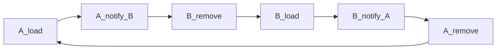
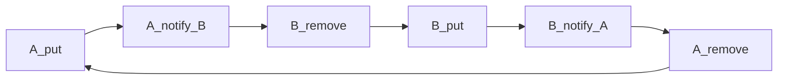
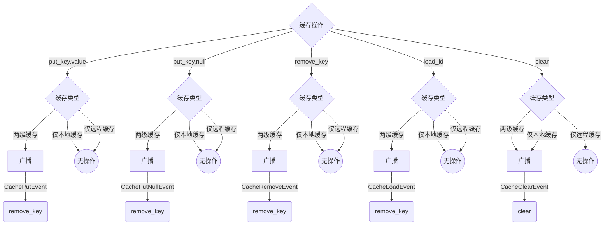

## 缓存设计与分析

## 源数据操作与缓存事件广播

### 新增数据（Create）

新增数据流程有两种选择：一是先新增数据到数据源，再新增数据到缓存；二是先新增数据到缓存，再新增数据到数据源。

具体采用哪种流程，需根据业务场景而定。

#### 仅有本地缓存

用户先通过 service(A) 新建数据，再通过 service(B) 查询数据。

1. 用户先通过 service(A) 新建数据：此情形 cacheProxy(A) 无需通知 cacheProxy(B)。
2. 用户再通过 service(B) 查询数据：此时 localCache(B) 无数据，先查询数据源，再保存到 localCache(B) ，最后返回数据给用户。

详细时序流程如下图所示：

```mermaid
sequenceDiagram
	actor->>service(A): 1: create(data)
	Note left of actor: create data on service(A)
	service(A)->>datasource: 1.1: insert(data)
	datasource-->>service(A): success
	service(A)->>cacheProxy(A): 1.2: put(id, data)
	cacheProxy(A)->>localCache(A): 1.3: put(id, data)
	localCache(A)-->>cacheProxy(A): success
	cacheProxy(A)-->>service(A): success
	service(A)-->>actor: success
	actor->>service(B): 2: get(id)
	Note left of actor: read data from service(B)
	service(B)->>cacheProxy(B): 2.1: get(id)
	cacheProxy(B)->>localCache(B): 2.2: get(id)
	localCache(B)-->>cacheProxy(B): no data
	cacheProxy(B)->>datasource: 2.3: load(id)
	datasource-->>cacheProxy(B): data
	cacheProxy(B)->>localCache(B): 2.4: put(id, data)
	localCache(B)-->>cacheProxy(B): success
	cacheProxy(B)-->>service(B): data
	service(B)-->>actor: data
```

#### 仅有远程缓存

用户先通过 service(A) 新建数据，再通过 service(B) 查询数据。

1. 用户先通过 service(A) 新建数据：此情形 cacheProxy(A) 无需通知 cacheProxy(B)。
2. 用户再通过 service(B) 查询数据：此时 remoteCache 已有数据，直接读取缓存数据返回给用户即可。

详细时序流程如下图所示：

```mermaid
sequenceDiagram
	actor->>service(A): 1: create(data)
	Note left of actor: create data on service(A)
	service(A)->>datasource: 1.1: insert(data)
	datasource-->>service(A): success
	service(A)->>cacheProxy(A): 1.2: put(id, data)
	cacheProxy(A)->>remoteCache: 1.3: put(id, data)
	remoteCache-->>cacheProxy(A): success
	cacheProxy(A)-->>service(A): success
	service(A)-->>actor: success
	actor->>service(B): 2: get(id)
	Note left of actor: read data from service(B)
	service(B)->>cacheProxy(B): 2.1: get(id)
	cacheProxy(B)->>remoteCache: 2.2: get(id)
	remoteCache-->>cacheProxy(B): data
	service(B)-->>actor: data
```

#### 两级缓存(本地+远程)

用户先通过 service(A) 新建数据，再通过 service(B) 查询数据。

1. 用户先通过 service(A) 新建数据：此情形 cacheProxy(A) 无需通知 cacheProxy(B)。
2. 用户再通过 service(B) 查询数据：此时 remoteCache 已有数据，直接读取缓存数据返回给用户即可。

详细时序流程如下图所示：

```mermaid
sequenceDiagram
	actor->>service(A): 1: create(data)
	Note left of actor: create data on service(A)
	service(A)->>datasource: 1.1: insert(data)
	datasource-->>service(A): success
	service(A)->>cacheProxy(A): 1.2: put(id, data)
	cacheProxy(A)->>localCache(A): 1.3: put(id, data)
	localCache(A)-->>cacheProxy(A): success
	cacheProxy(A)->>remoteCache: 1.4: put(id, data)
	remoteCache-->>cacheProxy(A): success
	cacheProxy(A)-->>service(A): success
	service(A)-->>actor: success
	actor->>service(B): 2: get(id)
	Note left of actor: read data from service(B)
	service(B)->>cacheProxy(B): 2.1: get(id)
	cacheProxy(B)->>localCache(B): 2.2: get(id)
	localCache(B)-->>cacheProxy(B): fail
	cacheProxy(B)->>remoteCache: 2.3: get(id)
	remoteCache-->>cacheProxy(B): success
	cacheProxy(B)->>localCache(B): 2.4: put(id, data)
	localCache(B)-->>cacheProxy(B): success
	cacheProxy(B)-->>service(B): success
	service(B)-->>actor: success
```

### 删除数据（Delete）

数据删除流程有两种选择：一是先删除缓存，再删除数据源；二是先删除数据源，再删除缓存。

删除缓存数据有两种选择：一是直接删除缓存数据；二是存入空数据到缓存。

至于具体采用哪种流程、哪种方式，需根据业务需求来确定。

#### 仅有本地缓存

用户先通过 service(A) 删除数据，再通过 service(B) 查询数据。

1. 用户先通过 service(A) 删除数据：此情形 cacheProxy(A) 需广播 CacheRemoveEvent 或 CachePutNullEvent 消息通知 cacheProxy(B)，否则 localCache(B) 可能返回旧数据。
2. 用户再通过 service(B) 查询数据：此时 localCache(B) 已无数据（或空数据），数据源也无数据，返回 no data。

详细时序流程如下图所示：

```mermaid
sequenceDiagram
	actor->>service(A): 1: delete(id)
	Note left of actor: delete data on service(A)
	service(A)->>datasource: 1.1: delete(id)
	datasource-->>service(A): success
	service(A)->>cacheProxy(A): 1.2: remove(id) or put(id, null)
	cacheProxy(A)->>localCache(A): 1.3: remove(id) or put(id, null)
	localCache(A)-->>cacheProxy(A): success
	cacheProxy(A)-->cacheProxy(B): 1.4: async notify(event)
	Note left of cacheProxy(A): async notify cacheProxy(B)
	cacheProxy(B)->>localCache(B):1.5: remove(id) or put(id, null)
	localCache(B)-->>cacheProxy(B): success
	cacheProxy(A)-->>service(A): success
	service(A)-->>actor: success
	actor->>service(B): 2: get(id)
	Note left of actor: read data from service(B)
	service(B)->>cacheProxy(B): 2.1: get(id)
	cacheProxy(B)->>localCache(B): 2.2: get(id)
	localCache(B)-->>cacheProxy(B): no data
	cacheProxy(B)-->>service(B): no data
	service(B)-->>actor: no data
```

#### 仅有远程缓存

用户先通过 service(A) 删除数据，再通过 service(B) 查询数据。

1. 用户先通过 service(A) 删除数据：此情形 cacheProxy(A) 无需通知 cacheProxy(B)。
2. 用户再通过 service(B) 查询数据：此时 remoteCache 已无数据（或空数据），数据源也无数据，返回 no data。

详细时序流程如下图所示：

```mermaid
sequenceDiagram
	actor->>service(A): 1: delete(id)
	Note left of actor: delete data on service(A)
	service(A)->>datasource: 1.1: delete(id)
	datasource-->>service(A): success
	service(A)->>cacheProxy(A): 1.2: remove(id) or put(id, null)
	cacheProxy(A)->>remoteCache: 1.3: remove(id) or put(id, null)
	remoteCache-->>cacheProxy(A): success
	cacheProxy(A)-->>service(A): success
	service(A)-->>actor: success
	actor->>service(B): 2: get(id)
	Note left of actor: read data from service(B)
	service(B)->>cacheProxy(B): 2.1: get(id)
	cacheProxy(B)->>remoteCache: 2.2: get(id)
	remoteCache-->>cacheProxy(B): no data
	cacheProxy(B)-->>service(B): no data
	service(B)-->>actor: no data
```

#### 两级缓存(本地+远程)

用户先通过 service(A) 删除数据，再通过 service(B) 查询数据。

1. 用户先通过 service(A) 删除数据：此情形 cacheProxy(A) 需广播 CacheRemoveEvent 或 CachePutNullEvent 消息通知 cacheProxy(B)，否则 localCache(B) 可能返回旧数据。
2. 用户再通过 service(B) 查询数据：此时 localCache(B) 和 remoteCache 均无数据（或空数据），数据源也无数据，返回 no data。

详细时序流程如下图所示：

```mermaid
sequenceDiagram
	actor->>service(A): 1: delete(id)
	Note left of actor: delete data on service(A)
	service(A)->>datasource: 1.1: delete(id)
	datasource-->>service(A): success
	service(A)->>cacheProxy(A): 1.2: remove(id) or put(id, null)
	cacheProxy(A)->>remoteCache: 1.3: remove(id) or put(id, null)
	remoteCache-->>cacheProxy(A): success
	cacheProxy(A)->>localCache(A): 1.3: remove(id) or put(id, null)
	localCache(A)-->>cacheProxy(A): success
	cacheProxy(A)-->cacheProxy(B): 1.4: async notify(event)
	Note left of cacheProxy(A): async notify cacheProxy(B)
	cacheProxy(B)->>localCache(B):1.5: remove(id) or put(id, null)
	localCache(B)-->>cacheProxy(B): success
	localCache(A)-->>cacheProxy(A): success
	cacheProxy(A)-->>service(A): success
	service(A)-->>actor: success
	actor->>service(B): 2: get(id)
	Note left of actor: read data from service(B)
	service(B)->>cacheProxy(B): 2.1: get(id)
	cacheProxy(B)->>localCache(B): 2.2: get(id)
	localCache(B)-->>cacheProxy(B): no data
	cacheProxy(B)-->>service(B): no data
	service(B)-->>actor: no data
```

### 修改数据（Update）

数据更新流程有两种选择：一是先更新数据源，再更新缓存；二是先更新缓存，再更新数据源。

具体采用哪种流程，需根据业务场景而定。

#### 仅有本地缓存

用户先通过 service(A) 更新数据，再通过 service(B) 查询数据。

1. 用户先通过 service(A) 更新数据：此情形 cacheProxy(A) 需广播 CachePutEvent 消息通知 cacheProxy(B)，否则 localCache(B) 可能返回旧数据。
2. 用户再通过 service(B) 查询数据：此时 localCache(B) 已无数据，先查询数据源，再保存到 localCache(B) ，最后返回数据给用户。

详细时序流程如下图所示：

```mermaid
sequenceDiagram
	actor->>service(A): 1: update(data)
	Note left of actor: update data on service(A)
	service(A)->>datasource: 1.1: update(data)
	datasource-->>service(A): success
	service(A)->>cacheProxy(A): 1.2: put(id, data)
	cacheProxy(A)->>localCache(A): 1.3: put(id, data)
	localCache(A)-->>cacheProxy(A): success
	cacheProxy(A)-->cacheProxy(B): 1.4: async notify(event)
	Note left of cacheProxy(A): async notify cacheProxy(B)
	cacheProxy(B)->>localCache(B):1.5: remove(id)
	localCache(B)-->>cacheProxy(B): success
	cacheProxy(A)-->>service(A): success
	service(A)-->>actor: success
	actor->>service(B): 2: get(id)
	Note left of actor: read data from service(B)
	service(B)->>cacheProxy(B): 2.1: get(id)
	cacheProxy(B)->>localCache(B): 2.2: get(id)
	localCache(B)-->>cacheProxy(B): no data
	cacheProxy(B)->>datasource: 2.3: load(id)
	datasource-->>cacheProxy(B): data
	cacheProxy(B)->>localCache(B): 2.4: put(id, data)
	localCache(B)-->>cacheProxy(B): data
	cacheProxy(B)-->>service(B): data
	service(B)-->>actor: data
```

#### 仅有远程缓存

用户先通过 service(A) 更新数据，再通过 service(B) 查询数据。

1. 用户先通过 service(A) 更新数据：此情形 cacheProxy(A) 无需通知 cacheProxy(B)。
2. 用户再通过 service(B) 查询数据：此时 remoteCache(B) 已有新数据，直接从缓存获取数据返回给用户。

详细时序流程如下图所示：

```mermaid
sequenceDiagram
	actor->>service(A): 1: update(data)
	Note left of actor: update data on service(A)
	service(A)->>datasource: 1.1: update(data)
	datasource-->>service(A): success
	service(A)->>cacheProxy(A): 1.2: put(id, data)
	cacheProxy(A)->>remoteCache: 1.3: put(id, data)
	remoteCache-->>cacheProxy(A): success
	cacheProxy(A)-->>service(A): success
	service(A)-->>actor: success
	actor->>service(B): 2: get(id)
	Note left of actor: read data from service(B)
	service(B)->>cacheProxy(B): 2.1: get(id)
	cacheProxy(B)->>remoteCache: 2.2: get(id)
	remoteCache-->>cacheProxy(B): data
	cacheProxy(B)-->>service(B): data
	service(B)-->>actor: data
```

#### 两级缓存(本地+远程)

用户先通过 service(A) 更新数据，再通过 service(B) 查询数据。

1. 用户先通过 service(A) 更新数据：此情形 cacheProxy(A) 需广播 CachePutEvent 消息通知 cacheProxy(B)，否则 localCache(B) 可能返回旧数据。
2. 用户再通过 service(B) 查询数据：此时 localCache(B) 无数据，remoteCache 有数据，从 remoteCache 获取数据后，先保存到 localCache(B) ，然后再返回数据给用户。

详细时序流程如下图所示：

```mermaid
sequenceDiagram
	actor->>service(A): 1: update(data)
	Note left of actor: update data on service(A)
	service(A)->>datasource: 1.1: update(data)
	datasource-->>service(A): success
	service(A)->>cacheProxy(A): 1.2: put(id, data)
	cacheProxy(A)->>remoteCache: 1.3: put(id, data)
	remoteCache-->>cacheProxy(A): success
	cacheProxy(A)->>localCache(A): 1.3: put(id, data)
	localCache(A)-->>cacheProxy(A): success
	cacheProxy(A)-->cacheProxy(B): 1.4: async notify(event)
	Note left of cacheProxy(A): async notify cacheProxy(B)
	cacheProxy(B)->>localCache(B): 1.5: remove(id)
	localCache(B)-->>cacheProxy(B): success
	cacheProxy(A)-->>service(A): success
	service(A)-->>actor: success
	actor->>service(B): 2: get(id)
	Note left of actor: read data from service(B)
	service(B)->>cacheProxy(B): 2.1: get(id)
	cacheProxy(B)->>localCache(B): 2.2: get(id)
	localCache(B)-->>cacheProxy(B): no data
	cacheProxy(B)->>remoteCache: 2.3: get(id)
	remoteCache-->>cacheProxy(B): data
	cacheProxy(B)->>localCache(B): 2.4: put(id, data)
	localCache(B)-->>cacheProxy(B): success
	cacheProxy(B)-->>service(B): data
	service(B)-->>actor: data
```


### 查询数据（Read）
#### 仅有本地缓存

用户先通过 service(A) 查询数据，再通过 service(B) 查询数据。

1. 用户先通过 service(A) 查询数据：此情形 cacheProxy(A) **无需通知** cacheProxy(B)。
2. 用户再通过 service(B) 查询数据：此时 localCache(B) 无数据，先查询数据源，再保存到 localCache(B) ，最后返回 data 给用户。

> **特别注意：死循环！**
>
> 仅有本地缓存时，如果广播 CacheLoadEvent 消息：
>
> 用户访问 service(A)，cacheProxy(A) 需从数据源 load 数据，cacheProxy(A)  通知 cacheProxy(B)， localCache(B) 删除数据；
>
> 用户访问 service(B)，cacheProxy(B) 需从数据源 load 数据，cacheProxy(B)  通知 cacheProxy(A)， localCache(A) 删除数据。
>
> ……
>
> 应用之间会陷入死循环（如下图），用户的每次查询都需要回源：
>



详细时序流程如下图所示：

```mermaid
sequenceDiagram
	actor->>service(A): 1: get(id)
	Note left of actor: read data from service(A)
	service(A)->>cacheProxy(A): 1.1: get(id)
	cacheProxy(A)->>localCache(A): 1.2: get(id)
	localCache(A)-->>cacheProxy(A): no data
	cacheProxy(A)->>datasource: 1.3: load(id)
	datasource-->>cacheProxy(A): data
	cacheProxy(A)->>localCache(A): 1.4: put(id, data)
	localCache(A)-->>cacheProxy(A): success
	cacheProxy(A)-->>service(A): data
	service(A)-->>actor: data
	actor->>service(B): 2: get(id)
	Note left of actor: read data from service(B)
	service(B)->>cacheProxy(B): 2.1: get(id)
	cacheProxy(B)->>localCache(B): 2.2: get(id)
	localCache(B)-->>cacheProxy(B): no data
	cacheProxy(B)->>datasource: 2.3: get(id)
	datasource-->>cacheProxy(B): data
	cacheProxy(B)->>localCache(B): 2.4: put(id, data)
	localCache(B)-->>cacheProxy(B): success
	cacheProxy(B)-->>service(B): data
	service(B)-->>actor: data
```

#### 仅有远程缓存

用户先通过 service(A) 查询数据，再通过 service(B) 查询数据。

1. 用户先通过 service(A) 查询数据：此情形 cacheProxy(A) 无需通知 cacheProxy(B)。
2. 用户再通过 service(B) 查询数据：此时 remoteCache 已有数据，直接返回缓存数据给用户。

详细时序流程如下图所示：

```mermaid
sequenceDiagram
	actor->>service(A): 1: get(id)
	Note left of actor: read data from service(A)
	service(A)->>cacheProxy(A): 1.1: get(id)
	cacheProxy(A)->>remoteCache: 1.2: get(id)
	remoteCache-->>cacheProxy(A): no data
	cacheProxy(A)->>datasource: 1.3: load(id)
	datasource-->>cacheProxy(A): data
	cacheProxy(A)->>remoteCache: 1.4: put(id, data)
	remoteCache-->>cacheProxy(A): success
	cacheProxy(A)-->>service(A): data
	service(A)-->>actor: data
	actor->>service(B): 2: get(id)
	Note left of actor: read data from service(B)
	service(B)->>cacheProxy(B): 2.1: get(id)
	cacheProxy(B)->>remoteCache: 2.2: get(id)
	remoteCache-->>cacheProxy(B): data
	cacheProxy(B)-->>service(B): data
	service(B)-->>actor: data
```


#### 两级缓存(本地+远程)

用户先通过 service(A) 查询数据，再通过 service(B) 查询数据。

1. 用户先通过 service(A) 查询数据：当 cacheProxy(A) 需回源查询数据时，此情形 cacheProxy(A) 可能需广播 CacheLoadEvent 消息通知 cacheProxy(B)。
2. 用户再通过 service(B) 查询数据：此时 remoteCache 已有数据，先从 remoteCache 获取数据，然后保存到 localCache(B)，再返回缓存数据给用户。

> 如果数据的增删改查都归属于一类 service，那么所有 service 都能感知到数据变更。因此回源数据库后无需通知其它 service ，其它 service 等 localCache 数据自动过期之后再到远程缓存中读取即可。
>
> 如果分成两类 service ，一类 service 负责增删改（管理端），一类 service 只负责查询（用户端），那么用户端的 service 可能无法感知到数据变更。这种情形下，为了让用户端的所有 service 都能返回相同的数据，回源查询数据后需广播 CacheLoadEvent 消息。

详细时序流程如下图所示：

```mermaid
sequenceDiagram
	actor->>service(A): 1: get(id)
	Note left of actor: read data from service(A)
	service(A)->>cacheProxy(A): 1.1: get(id)
	cacheProxy(A)->>localCache(A): 1.2: get(id)
	localCache(A)-->>cacheProxy(A): no data
	cacheProxy(A)->>remoteCache: 1.3: get(id)
	remoteCache-->>cacheProxy(A): no data
	cacheProxy(A)->>datasource: 1.4: load(id)
	datasource-->>cacheProxy(A): data
	cacheProxy(A)->>remoteCache: 1.5: put(id, data)
	remoteCache-->>cacheProxy(A): success
	cacheProxy(A)-->cacheProxy(B): 1.6: async notify(event)
	Note left of cacheProxy(A): async notify cacheProxy(B)
	cacheProxy(B)->>localCache(B): 1.7: remove(id)
	localCache(B)-->>cacheProxy(B): success
	cacheProxy(A)->>localCache(A): 1.8: put(id, data)
	localCache(A)-->>cacheProxy(A): success
	cacheProxy(A)-->>service(A): data
	service(A)-->>actor: data
	actor->>service(B): 2: get(id)
	Note left of actor: read data from service(B)
	service(B)->>cacheProxy(B): 2.1: get(id)
	cacheProxy(B)->>localCache(B): 2.2: get(id)
	localCache(B)-->>cacheProxy(B): no data
	cacheProxy(B)->>remoteCache: 2.3: get(id)
	remoteCache-->>cacheProxy(B): data
	cacheProxy(B)->>localCache(B): 2.4: put(id, data)
	localCache(B)-->>cacheProxy(B): success
	cacheProxy(B)-->>service(B): data
	service(B)-->>actor: data
```

### 清空数据（Clear）

#### 仅有本地缓存

用户先通过 service(A) 清空数据，再通过 service(B) 查询数据。

1. 用户先通过 service(A) 清理数据：此情形 cacheProxy(A) 需广播 CacheClearEvent 消息通知 cacheProxy(B)。
2. 用户再通过 service(B) 查询数据：此时 localCache(B) 无数据，先查询数据源，再保存空数据到 localCache(B) ，最后返回 no data 给用户。

详细时序流程如下图所示：

```mermaid
sequenceDiagram
	actor->>service(A): 1: clear
	Note left of actor: clear all data on service(A)
	service(A)->>datasource: 1.1: clear
	datasource-->>service(A): success
	service(A)->>cacheProxy(A): 1.2: clear
	cacheProxy(A)->>localCache(A): 1.3: clear
	localCache(A)-->>cacheProxy(A): success
	cacheProxy(A)-->cacheProxy(B): 1.4 async notify(event)
	Note left of cacheProxy(A): async notify cacheProxy(B)
	cacheProxy(B)->>localCache(B): 1.5: clear
	localCache(B)-->>cacheProxy(B): success
	cacheProxy(A)-->>service(A): success
	service(A)-->>actor: success
	actor->>service(B): 2: get(id)
	Note left of actor: read data from service(B)
	service(B)->>cacheProxy(B): 2.1: get(id)
	cacheProxy(B)->>localCache(B): 2.2: get(id)
	localCache(B)-->>cacheProxy(B): no data
	cacheProxy(B)->>datasource: 2.3: get(id)
	datasource-->>cacheProxy(B): no data
	cacheProxy(B)->>localCache(B): 2.4: put(id, null)
	localCache(B)-->>cacheProxy(B): success
	cacheProxy(B)-->>service(B): no data
	service(B)-->>actor: no data
```

#### 仅有远程缓存

用户先通过 service(A) 清空数据，再通过 service(B) 查询数据。

1. 用户先通过 service(A) 清理数据：此情形 cacheProxy(A) 无需通知 cacheProxy(B)。
2. 用户再通过 service(B) 查询数据：此时 remoteCache 无数据，先查询数据源，再保存空数据到 remoteCache，最后返回 no data 给用户。

详细时序流程如下图所示：

```mermaid
sequenceDiagram
	actor->>service(A): 1: clear
	Note left of actor: clear all data on service(A)
	service(A)->>datasource: 1.1: clear
	datasource-->>service(A): success
	service(A)->>cacheProxy(A): 1.2: clear
	cacheProxy(A)->>remoteCache: 1.3: clear
	remoteCache-->>cacheProxy(A): success
	cacheProxy(A)-->>service(A): success
	service(A)-->>actor: success
	actor->>service(B): 2: get(id)
	Note left of actor: read data from service(B)
	service(B)->>cacheProxy(B): 2.1: get(id)
	cacheProxy(B)->>remoteCache: 2.2: get(id)
	remoteCache-->>cacheProxy(B): no data
	cacheProxy(B)->>datasource: 2.3: get(id)
	datasource-->>cacheProxy(B): no data
	cacheProxy(B)->>remoteCache: 2.4: put(id, null)
	remoteCache-->>cacheProxy(B): success
	cacheProxy(B)-->>service(B): no data
	service(B)-->>actor: no data
```


#### 两级缓存(本地+远程)

用户先通过 service(A) 清空数据，再通过 service(B) 查询数据。

1. 用户先通过 service(A) 清空数据：此情形 cacheProxy(A) 需广播 CacheClearEvent 通知 cacheProxy(B)。
2. 用户再通过 service(B) 查询数据：此时 remoteCache 和 localCache(B) 已无数据，先回源查询数据，然后保存空值到remoteCache 和 localCache(B)，再返回 no data 给用户。

详细时序流程如下图所示：

```mermaid
sequenceDiagram
	actor->>service(A): 1: clear
	Note left of actor: clear all data on service(A)
	service(A)->>datasource: 1.1: clear
	datasource-->>service(A): success
	service(A)->>cacheProxy(A): 1.2: clear
	cacheProxy(A)->>remoteCache: 1.3: clear
	remoteCache-->>cacheProxy(A): success
	cacheProxy(A)->>localCache(A): 1.4: clear
	localCache(A)-->>cacheProxy(A): success
	cacheProxy(A)-->cacheProxy(B): 1.5: async notify(event)
	Note left of cacheProxy(A): async notify cacheProxy(B)
	cacheProxy(B)->>localCache(B): 1.6: clear
	localCache(B)-->>cacheProxy(B): success
	cacheProxy(A)-->>service(A): success
	service(A)-->>actor: success
	actor->>service(B): 2: get(id)
	Note left of actor: read data from service(B)
	service(B)->>cacheProxy(B): 2.1: get(id)
	cacheProxy(B)->>localCache(B): 2.2: get(id)
	localCache(B)-->>cacheProxy(B): no data
	cacheProxy(B)->>remoteCache: 2.3: get(id)
	remoteCache-->>cacheProxy(B): no data
	cacheProxy(B)->>datasource: 2.4: load(id)
	datasource-->>cacheProxy(B): no data
	cacheProxy(B)->>remoteCache: 2.5: put(id, null)
	remoteCache-->>cacheProxy(B): success
	cacheProxy(B)->>localCache(B): 2.6: put(id, null)
	localCache(B)-->>cacheProxy(B): success
	cacheProxy(B)-->>service(B): no data
	service(B)-->>actor: no data
```

### 事件分析

#### 数据汇总

| 序   | 数据操作 |   缓存类型   |        发送方缓存操作         |              发送事件类型              |      接收方本地缓存操作       |
| ---- | :------: | :----------: | :---------------------------: | :------------------------------------: | :---------------------------: |
| 1    | 新增数据 | 仅有本地缓存 |        put(key, value)        |                   无                   |              无               |
| 2    | 新增数据 | 仅有远程缓存 |        put(key, value)        |                   无                   |              无               |
| 3    | 新增数据 |  本地+远程   |        put(key, value)        |                   无                   |              无               |
| 4    | 删除数据 | 仅有本地缓存 | remove(key) \| put(key, null) | CacheRemoveEvent <br>CachePutNullEvent | remove(key) \| put(key, null) |
| 5    | 删除数据 | 仅有远程缓存 | remove(key) \| put(key, null) |                   无                   |              无               |
| 6    | 删除数据 |  本地+远程   | remove(key) \| put(key, null) | CacheRemoveEvent<br/>CachePutNullEvent | remove(key) \| put(key, null) |
| 7    | 修改数据 | 仅有本地缓存 |        put(key, value)        |        【?】CachePutEvent【?】         |    【?】remove(key) 【?】     |
| 8    | 修改数据 | 仅有远程缓存 |        put(key, value)        |                   无                   |              无               |
| 9    | 修改数据 |  本地+远程   |        put(key, value)        |             CachePutEvent              |          remove(key)          |
| 10   | 查询数据 | 仅有本地缓存 |      get(key) & load(id)      |                   无                   |              无               |
| 11   | 查询数据 | 仅有远程缓存 |      get(key) & load(id)      |                   无                   |              无               |
| 12   | 查询数据 |  本地+远程   |      get(key) & load(id)      |             CacheLoadEvent             |          remove(key)          |
| 13   | 清空数据 | 仅有本地缓存 |            clear()            |            CacheClearEvent             |            clear()            |
| 14   | 清空数据 | 仅有远程缓存 |            clear()            |                   无                   |              无               |
| 15   | 清空数据 |  本地+远程   |            clear()            |            CacheClearEvent             |            clear()            |

#### 问题一

从表中我们可以看出 put(key, value) 操作对应有 “新增数据” 和 “修改数据” 这两种源数据操作，“新增数据”无需发送 event，“修改数据” 需发送 event，且对应有不同的操作。

正常来说，缓存框架只知道缓存内部的 put(key, value) 操作，并不知道前置的源数据操作是 “新增数据” 还是 “修改数据”，除非应用能告知缓存框架，但这样的话缓存框架就会严重侵入业务代码，并不是一个好的设计。

**解决办法**：

如果是两级缓存(本地+远程)，无论是 “新增数据” 还是 “修改数据”，都广播 CachePutEvent，接收到此 CachePutEvent 的 cacheProxy都执行 remove(key) 操作，但是会多一些查询 remoteCache 的操作。

#### 问题二

第 7 条规则：“修改数据” 操作。

仅有本地缓存时，为防止用户读取旧数据，put(key, value) 后应广播 CachePutEvent，接收方应执行 remove(key) 操作。

但因无法确定 put(key, value)  之前缓存外部的前置操作一定是 “修改数据”，如果对所有的 put(key, value) 都广播 CachePutEvent，则可能出现死循环。



**解决办法**：

如果仅有本地缓存，想要避免出现死循环，对于 put(key, value) 操作，只能不广播 CachePutEvent。

其它 service 的本地缓存只能等数据到期后自动失效，各个 service 的缓存数据不一致是无法避免的。

如要真正解决这个问题，只能**增加远程缓存**。

#### 问题三

第 4 条规则：“删除数据” 操作。

当仅有本地缓存时，如果发布 CacheRemoveEvent，多个接收方可能会同时执行 remove(key) 操作，然后同时回源查询数据，导致数据源压力过大。

**解决办法**：

增加远程缓存，解决多个 service 同时回源导致数据源压力过大问题。

> 如果发布 CachePutNullEvent，接收方执行 put(key, null) 逻辑删除来代替物理删除，可以解决数据源压力过大的问题。但又会引入新的问题，如果接收方执行 put(key, null) 之前，相同的 key 又创建了一条新数据，那么新建数据会被空值

### 最终逻辑



#### 事件总结

1. 仅有远程缓存时，无需广播任何 event。
2. 仅有本地缓存时，仅广播 CacheClearEvent。
3. 两级缓存都有时，五种类型的 event 都需广播。
4. 接收方收到非 CacheClearEvent 后，本地缓存都执行 remove(key) 操作。
5. 一个应用既是生产者也是消费者，因此发布者可能会收到自己发布的事件，代码实现中需过滤此类事件。

> 提示：一个应用如果有多个相同的 service 同时提供服务，请配置远程缓存。

### 装配流程

```mermaid
sequenceDiagram
	actor->>CacheManager: 1: config
	Note left of actor: create CacheSync
	CacheManager->>CacheManager: 1.1: create sid
	CacheManager->>CacheManager: 1.1: create CacheConfig
	CacheManager->>CacheProps: 1.1: get channel
	CacheProps-->>CacheManager: 1.1: channel
	CacheManager->>CacheProps: 1.1: get CacheType
	CacheProps-->>CacheManager: 1.1: CacheType
	CacheManager->>CacheSyncProvider: 1.2: getCacheMessagePublisher
	CacheSyncProvider-->>CacheManager: CacheMessagePublisher
	CacheManager->>CacheManager: 1.3: create CacheSyncMonitor
	CacheManager->>CacheConfig: 1.4: add CacheSyncMonitor
	CacheConfig-->>CacheManager: success
	CacheManager->>CacheStoreProvider: 1.5: get LocalCacheStore
	CacheStoreProvider-->>CacheManager: LocalCacheStore
	CacheManager->>CacheManager: 1.6 createCacheSyncConsumer
	CacheManager->>CacheSyncProvider: 1.7: registerCacheSyncConsumer
	CacheSyncProvider-->>CacheManager: success
```

## 缓存配置

```yaml
xcache:
  application: shop
  T0:
    charset: UTF-8
    cache-type: both
    local:
      cache-store: caffeineCacheStoreProvider
      store-name: caffeine
      initial-capacity: 1024
      maximum-size: 2048
      maximum-weight: 0
      key-strength: none
      value-strength: none
      expire-after-write: 3600000
      expire-after-access: 300000
      enable-random-ttl: true
      enable-null-value: true
      value-compressor: gzipCompressorProvider
      value-serializer: jacksonSerializerProvider
    remote:
      cache-store: lettuceCacheStoreProvider
      store-name: redis-string
      expire-after-write: 7200000
      enable-key-prefix: true
      enable-random-ttl: true
      enable-null-value: true
      value-compressor: gzipCompressorProvider
      value-serializer: jacksonSerializerProvider
    extension:
      key-convertor: jacksonKeyConvertorProvider
      cache-lock: localCacheLockProvider
      cache-lock-size: 128
      cache-stat: logCacheStatManager
      cache-sync: lettuceCacheSyncProvider
      cache-sync-channel: shop
      cache-sync-serializer: jacksonKeyConvertorProvider
      cache-loader: none
      cache-monitors: none
      contains-predicate: alwaysTruePredicateProvider
    metadata:
  caches:
    - name: user
      template: T0
    - name: order
      template: T0
  redis:
    - id:
  stat:
    cache-stat-period: 10000
  sync:
```

String 类型：未配置，使用默认配置；none，禁用此配置项。

Number 类型：未配置，使用默认配置；0，禁用此配置项。

Boolean 类型：未配置，使用默认配置。

```mermaid
sequenceDiagram
	actor->>CacheManager: 1: create config
	CacheManager->>DefaultCacheProps: 1.1: 获取默认配置
	CacheManager->>CacheConfigUtil: 1.2: 获取用户模板配置
	CacheManager->>CacheConfigUtil: 1.3: 用户模板配置 覆盖 默认配置
	CacheManager->>CacheConfigUtil: 1.4: 获取用户缓存配置
	CacheManager->>CacheConfigUtil: 1.4: 用户缓存配置 覆盖 用户模板配置
	CacheManager->>CacheConfigUtil: 1.4: 用户缓存配置 覆盖 用户模板配置
```


## 缓存指标


## 缓存锁设计


## 缓存键转换


## 缓存数据序列化