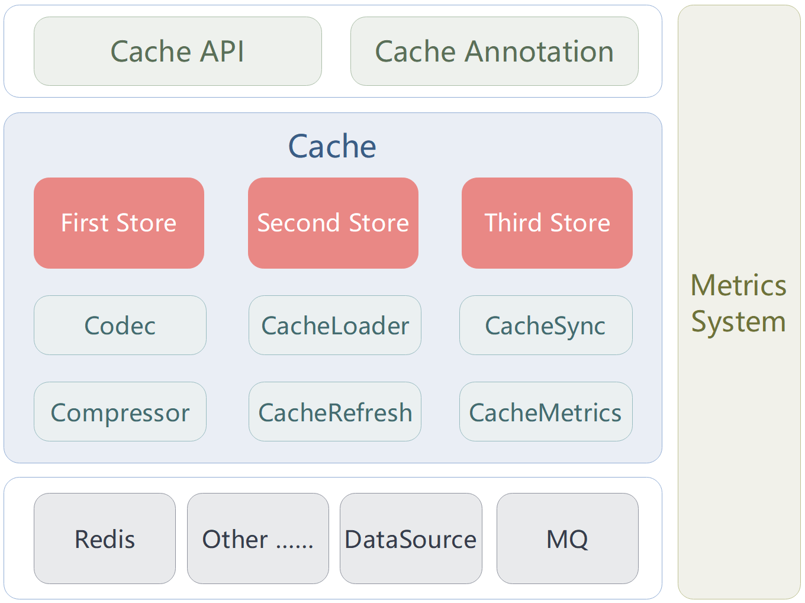

## Xcache

[](https://www.apache.org/licenses/LICENSE-2.0.html) [](https://github.com/patricklaux/xcache/releases) [](https://central.sonatype.com/namespace/com.igeeksky.xcache) [](https://github.com/patricklaux/xcache/commits)

## 1. 简介

`Xcache` 是易于扩展、功能强大且配置灵活的 Java 多级缓存框架。

## 2. 基本架构



**说明**：

* `Cache API`：缓存操作接口。
* `Cache Annotation`：缓存注解。
* `Cache`：缓存对象。
* `Store`：缓存数据存储，每个缓存对象实例最多可支持三级缓存数据存储。
* `Codec`：数据编解码（序列化与反序列化）。
* `Compressor`：数据压缩。
* `CacheLoader`：数据加载，用于从数据源读取数据。
* `CacheRefresh`：缓存数据刷新，定时通过 `CacheLoader` 加载并刷新缓存数据。
* `CacheSync`：缓存数据同步，用于维护各实例间私有缓存数据的一致性。
* `CacheMetrics`：缓存指标采集，用于记录缓存调用次数及命中率等指标。
* `MetricsSystem`：缓存指标信息的存储、计算与展示。
* `MQ`：消息队列，用于转发数据同步消息（已有实现采用 `Redis Stream`）。
* `DataSource`：数据源。
* `Redis` or `Other……`：缓存数据存储仓库。

## 3. 特性

- 支持多级缓存：一级缓存采用 `Caffeine`，二级缓存采用 `Redis`，最多可支持三级缓存。
- 缓存数据同步：通过缓存事件广播，多个应用实例的缓存数据保持一致。
- 缓存指标统计：支持调用次数、命中次数等指标，数据呈现可自由扩展。
- 缓存数据刷新：定时自动刷新缓存数据，避免慢查询导致应用响应缓慢。
- 随机存活时间：可选择自动生成随机存活时间，避免大量数据集中过期，导致数据源压力过大。
- 数据回源加锁：同一个键同一时刻仅允许一个线程回源查询，减轻数据源压力。
- 数据存在断言：可选择实现数据存在断言接口，譬如 `Bloom Filter`，减少无效回源查询。
- 支持缓存空值：可选择缓存空值，减少无效回源查询。
- 缓存数据压缩：可选择数据压缩，降低内存(磁盘)消耗。
- 支持缓存注解：`Cacheable`，`CacheableAll`，`CachePut`，`CachePutAll`，…… ，`CacheClear`
- 适配 `Spring Cache` 注解：如希望使用 `Spring Cache` 注解，可依赖 `Xcache` 适配项目，即可解锁更多功能。

## 4. 运行环境

`SpringBoot`：3.3.0+

`JDK`：21+

## 5. 开始使用

以下代码片段来自于 [xcache-samples](https://github.com/patricklaux/xcache-samples)，如需获取更详细信息，您可以克隆示例项目到本地进行调试。

```bash
git clone https://github.com/patricklaux/xcache-samples.git
```

### 5.1. 第一步：引入缓存依赖

如直接通过调用方法操作缓存，不使用缓存注解，仅需引入 `xcache-spring-boot-starter` 。

主要依赖：`Caffeine`（内嵌缓存），`Lettuce`（`Redis` 客户端），`Jackson`（序列化）

```xml
<dependencies>
    <dependency>
        <groupId>com.igeeksky.xcache</groupId>
        <artifactId>xcache-spring-boot-starter</artifactId>
        <version>${xcache.version}</version>
    </dependency>
    <!-- ... other ... -->
</dependencies>
```

### 5.2. 第二步：编写缓存配置

```yaml
xcache: #【1】xcache 配置的根节点
  group: shop #【2】分组名称（必填），主要用于区分不同的应用
  template: #【3】缓存公共配置模板（必填），列表类型，可配置一至多个
    - id: t0 #【4】 模板ID（必填）
      first: #【5】 一级缓存配置
        provider: caffeine #【6】使用 caffeine 作为一级缓存（默认值：caffeine）
```

**说明**：

* 【1-4】仅有的 4 个必填项。`Xcache` 提供了丰富的配置项，大部分有默认值，因此可以省略。
* 【3~8】缓存公共配置模板：同一应用中，一般会有多个缓存实例，配置通常相同。为减少重复配置，可使用公共配置模板。

另，每一个配置项都有详细介绍，可借助 ide 的自动提示功能快速查看配置描述。

或直接查看 `com.igeeksky.xcache.props.CacheProps`，了解详细的配置信息。

### 5.3. 第三步：调用缓存方法

```java
/**
 * 用户缓存服务
 */
@Service
public class UserCacheService {

    private final UserDao userDao;
    private final Cache<Long, User> cache;
    private final CacheLoader<Long, User> cacheLoader;

    public UserCacheService(UserDao userDao, CacheManager cacheManager) {
        this.userDao = userDao;
        this.cache = cacheManager.getOrCreateCache("user", Long.class, User.class);
        this.cacheLoader = new UserCacheLoader(this.userDao);
    }

    /**
     * 根据用户ID获取单个用户信息
     *
     * @param id 用户ID
     * @return 用户信息
     */
    public User getUser(Long id) {
        // 1. 首先查询缓存，如果缓存命中，则直接返回缓存数据；
        // 2. 如果缓存未命中，则调用 cacheLoader 从数据源加载数据。
        return cache.getOrLoad(id, cacheLoader);
    }

    /**
     * 根据用户ID批量获取用户信息
     *
     * @param ids 用户ID集合
     * @return 用户信息集合
     */
    public Map<Long, User> getUsers(Set<Long> ids) {
        // 1. 首先查询缓存，如果缓存全部命中，则直接返回缓存数据；
        // 2. 如果缓存全部未命中或部分命中，则调用 cacheLoader 从数据源加载未命中数据。
        return cache.getAllOrLoad(ids, this.cacheLoader);
    }

    /**
     * 新增用户
     *
     * @param user 新用户信息
     * @return 保存到数据库后返回的用户信息
     */
    public User saveUser(User user) {
        User created = userDao.save(user);
        // 将新增用户信息写入缓存
        cache.put(user.getId(), created);
        return created;
    }

    /**
     * 更新用户信息
     *
     * @param user 待更新的用户信息
     * @return 保存到数据库后返回的用户信息
     */
    public User updateUser(User user) {
        User updated = userDao.update(user);
        // 将更新后的用户信息写入缓存
        cache.put(user.getId(), updated);
        // 如果为了更好地保持数据一致性，这里可选择直接删除缓存数据，后续查询时再从数据源加载
        // cache.remove(user.getId());
        return updated;
    }

    /**
     * 批量更新用户信息
     *
     * @param users 待更新的用户信息集合
     * @return 保存到数据库后返回的用户信息集合
     */
    public Map<Long, User> updateUsers(List<User> users) {
        Map<Long, User> updated = userDao.batchUpdate(users);
        // 将更新后的用户信息写入缓存
        cache.putAll(updated);
        // 如果为了更好地保持数据一致性，这里可选择直接删除缓存数据，后续查询时再从数据源加载
        // cache.removeAll(updated.keySet());
        return updated;
    }

    /**
     * 删除用户信息
     *
     * @param id 用户ID
     */
    public void deleteUser(Long id) {
        userDao.delete(id);
        // 删除缓存数据
        cache.remove(id);
    }

    /**
     * 批量删除用户信息
     *
     * @param ids 用户ID集合
     */
    public void deleteUsers(Set<Long> ids) {
        userDao.batchDelete(ids);
        // 批量删除缓存数据
        cache.removeAll(ids);
    }

    /**
     * 清空数据
     */
    public void clear() {
        userDao.clear();
        // 清空缓存数据
        cache.clear();
    }

    /**
     * CacheLoader 实现类
     * <p>
     * 用于数据回源操作，当缓存中不存在指定数据时，会调用此方法从数据源加载数据。
     *
     * @param userDao
     */
    private record UserCacheLoader(UserDao userDao) implements CacheLoader<Long, User> {

        @Override
        public User load(Long id) {
            return this.userDao.findUser(id);
        }

        @Override
        public Map<Long, User> loadAll(Set<? extends Long> ids) {
            return this.userDao.findUserList(ids);
        }

    }

}
```

### 5.4. 更多使用信息

详细介绍：[Xcache 使用手册](docs/Reference.md)

## 6. 项目构建

如希望尝试新特性，可以将项目克隆到本地进行编译。

```bash
# 1. git clone项目到本地
git clone https://github.com/patricklaux/xcache.git

# 2. 进入项目目录
cd xcache

# 3. 执行 maven 命令编译
mvn clean install

# xcache 部分测试用例依赖 Redis，如构建时不希望运行测试用例，可执行：
# mvn clean install -DskipTests
```

## 7. 项目参与

### 7.1. 分支开发

| 分支     | 说明                  |
| -------- | --------------------- |
| **main** | 主分支，用于版本发布  |
| **dev**  | 开发分支，用于接受 PR |

如您希望参与开发，请 fork 项目到您的仓库，修改 dev 分支并提交 pr。

### 7.2. 寻求帮助

https://github.com/patricklaux/xcache/discussions

如您希望了解如何使用 xcache，或在使用中遇到问题无法解决，欢迎在此提问。

### 7.3. 建议反馈

https://github.com/patricklaux/xcache/issues

如您发现功能缺陷，或有任何开发建议，欢迎在此提交。

如您发现安全漏洞，请私信与我联系。

## 8. 许可证

Xcache 采用 Apache License Version 2.0 进行许可。有关详细信息，请参阅 [LICENSE](LICENSE) 文件。