# Xcache 设计与实现

**Author**: Patrick.Lau	**Version**: 1.0.0

--------

## 1. 概述

这篇文章是我在设计和实现过程中记录下来的点点滴滴。

`Xcache` 定义和实现了许多组件，如果希望更深入地了解框架逻辑，又或者希望根据业务需要实现自定义扩展，又或者希望能够参与 `Xcache` 的开发，那么阅读本文也许是个不错的选择。

不管如何，希望能有所帮助。如有建议，欢迎提出！谢谢！

---

## 2. 缓存操作流程

操作原则：**数据查询顺序从一级缓存到三级缓存，数据写入、删除顺序从三级缓存到一级缓存**。

### 2.1 数据查询
- **流程**：按照一级缓存 → 二级缓存 → 三级缓存的顺序依次查询。
- **图示**：
  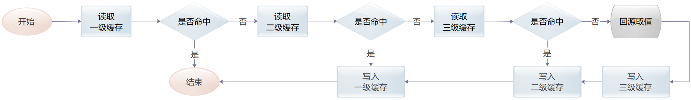

### 2.2 数据写入
- **流程**：按照三级缓存 → 二级缓存 → 一级缓存的顺序依次写入。
- **图示**：
  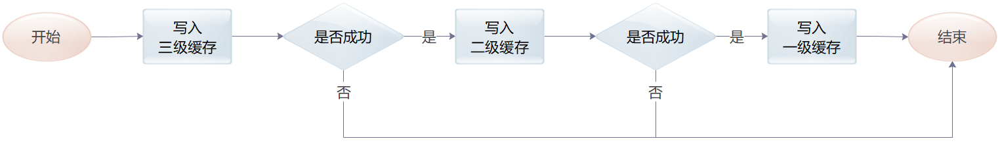

### 2.3 数据删除
- **流程**：按照三级缓存 → 二级缓存 → 一级缓存的顺序依次删除。
- **图示**：
  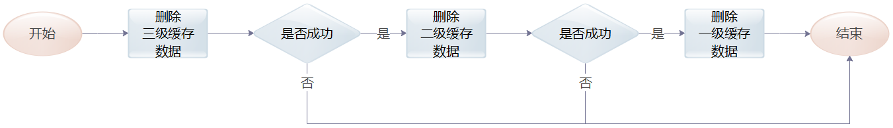

---

## 3. 缓存接口实现

### 3.1 接口与实现

| 接口     | `CacheManager`     | `Cache`                                                      |
| -------- | ------------------ | ------------------------------------------------------------ |
| **实现** | `CacheManagerImpl` | `NoOpcache` `OneLevelCache` `TwoLevelCache` `ThreeLevelCache` |

缓存实例`Cache` 由 `CacheManager` 统一创建和管理，根据不同配置创建不同类型的缓存实例：

* `ThreeLevelCache`：**三级缓存**
* `TwoLevelCache`：**两级缓存**
* `OneLevelCache`：**一级缓存**
* `NoOpcache`：**空操作缓存**（如原来有使用缓存，现不再继续使用，可通过配置修改，无需修改代码）

### 3.2 图示

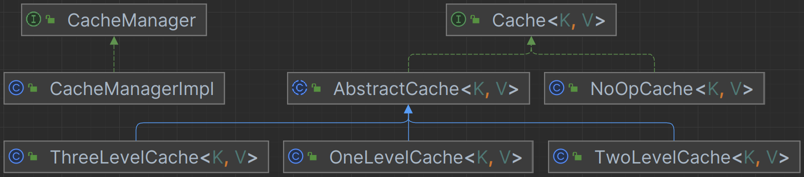

---

## 4. 缓存数据存储

### 4.1 接口与实现

| 接口         | `StoreProvider`         | `Store`                                                      |
| ------------ | ----------------------- | ------------------------------------------------------------ |
| **Caffeine** | `CaffeineStoreProvider` | `CaffeineStore`                                              |
| **Redis**    | `RedisStoreProvider`    | `RedisStringStore` `RedisHashStore` `RedisClusterHashStore` |

* `StoreProvider` 为工厂接口，用于创建 `Store` 对象。

### 4.2. Caffeine

`Caffeine` 是高性能的 Java 缓存库，关于其性能和设计这里不再赘述，感兴趣的移步 [Github](https://github.com/ben-manes/caffeine)。

这里介绍一下 其预留的一些扩展点，及如何在 `Xcache` 中运用这些扩展点。

#### 随机过期时间

`RandomRangeExpiry`

为避免缓存数据大批量集中过期，导致数据源压力过大，那么可以使用随机生成过期时间。

当配置项 `enable-random-ttl` 为 `true` ，且 `expire-after-create` 大于 0 时，`Caffeine` 将使用 `RandomRangeExpiry` 作为过期时间策略。

* 当保存或更新缓存数据时，`RandomRangeExpiry` 将生成一个随机过期时间：

  `long timeToLive = RandomUtils.nextLong(expireAfterCreate * 0.8, expireAfterCreate);`
  
* 当访问缓存数据时，`RandomRangeExpiry` 将比较该数据剩余存活时间 和配置的 `expireAfterAccess`，并返回较大值：

  `long timeToLive =  Math.max(currentDuration, expireAfterAccess);`  (`currentDuration` 为剩余存活时间)

#### 扩展：过期时间策略

如果用户希望创建自定义的过期时间策略，那么可以实现 `Expiry` 接口，并通过 `CaffeineExpiryRegister` 注册到 Spring 容器。

`CaffeineStoreProvider` 在创建 `CaffeineStore` 时，会通过缓存名称查找并使用注入的对象。

#### 扩展：权重计算策略

如果用户希望创建自定义的权重计算策略，那么可以实现 `Weigher` 接口，并通过 `CaffeineWeigherRegister` 注册到 Spring 容器。

`CaffeineStoreProvider` 在创建 `CaffeineStore` 时，会通过缓存名称查找并使用注入的对象。

### 4.3. Redis

`RedisStoreProvider` 会根据用户的配置不同而创建不同类型的对象。

#### RedisStringStore

`RedisStringStore` 使用 `Redis-String` 作为数据存储，支持 `Standalone` 、 `Sentinel`  和 `Cluster` 模式。

如果 Redis 的版本低于 7.4.0，且需要设置过期时间，那么请使用 `Redis-String` 作为数据存储。

#### RedisHashStore

`RedisHashStore` 使用 `Redis-Hash` 作为数据存储，支持 `Standalone` 和 `Sentinel`  模式。

另，Redis 7.4.0 及之后的版本，已经支持对 Hash 字段设置过期时间，

#### RedisClusterHashStore

`RedisHashStore` 使用 `Redis-Hash` 作为数据存储，支持 `cluster` 模式。

**一致性 Hash**

当使用集群模式，且数据存储使用 `Redis-Hash` 数据结构时，为了避免数据集中在某个节点进行存储，`RedisClusterHashStore` 会创建多个 `HashTable` 作为数据 `slot`，名称为 `cache-name:0`, `cache-name:1`, ...  , `cache-name:n-1`, `cache-name:n`。

`n` 的值可以通过 `data-slot-size` 进行配置，默认为 16。

当需要查询或操作数据时，将根据键的 `CRC16` 计算值求余得到数据所在的 `slot`。

---

## 5. 数据存在断言
### 5.1. 接口与实现

|     接口     | `ContainsPredicate`           |
| :----------: | ----------------------------- |
| **默认实现** | `AlwaysTrueContainsPredicate` |

* `ContainsPredicate`

  此接口用于判断数据源是否存在键对应的值，主要是为了解决缓存穿透问题。

  缓存框架在调用 `CacheLoader` 之前会先调用 `ContainsPredicate`，只有断言为 `true`，才会调用 `CacheLoader` 。

  因为功能实现与业务密切相关，所以缓存框架仅定义接口，具体功能需用户自行实现。

  譬如：定时读取数据源的所有 ID ，并生成（更新）布隆过滤器。

* `AlwaysTrueContainsPredicate`

  此实现将永远返回 `true`，当用户未提供 `ContainsPredicate` 的具体实现时，将使用此实现类的单例对象作为替代。
  
* `ContainsPredicateRegister`

  用户实现 `ContainsPredicate` 后可通过 `ContainsPredicateRegister` 注册到 Spring 容器。

  `CacheManager` 在创建 `Cache` 时，会通过缓存名称查找并使用注入的对象。

---

## 6. 缓存锁

### 6.1. 接口与实现

| 接口         | `CacheLockProvider`      | `LockService`      | `Lock`          |
| ------------ | ------------------------ | ------------------ | --------------- |
| **内嵌锁**   | `EmbedCacheLockProvider` | `EmbedLockService` | `EmbedLock`     |
| **Redis 锁** | `RedisLockProvider`      | `RedisLockService` | `RedisSpinLock` |

* `CacheLockProvider`：工厂类。用于创建 `LockService`。

* `LockService`：锁服务。根据传入的 `Key` 创建锁或获取已有的锁，并使用计数器来管理锁的生命周期。

* `Lock`：锁对象。内嵌锁使用 `ReentrantLock` 实现；Redis 锁使用脚本实现锁逻辑。
* `EmbedLock`：内嵌锁。锁的作用范围为单个应用实例。
* `RedisSpinLock`：分布式锁。锁的作用范围为所有应用实例。

### 6.2. 加锁解锁流程

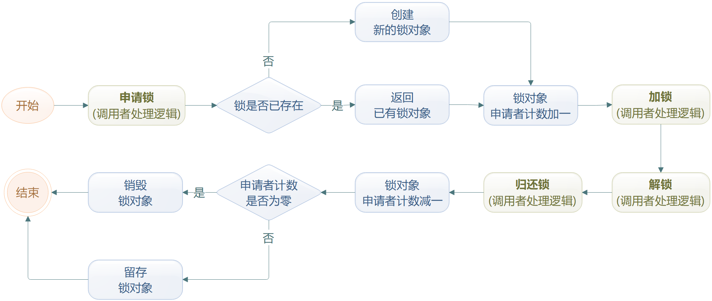

---------------------

## 7. 数据回源加载

### 7.1. 接口

* `CacheLoader`

  此接口用于用于从数据源加载数据。

  缓存框架仅定义接口，具体功能需用户自行实现。

* `CacheLoaderRegister`

  用户实现 `CacheLoader` 后可通过 `CacheLoaderRegister` 注册到 Spring 容器。

  `CacheManager` 在创建 `Cache` 时，会通过缓存名称查找并使用注入的对象。

### 7.2. 回源加载流程

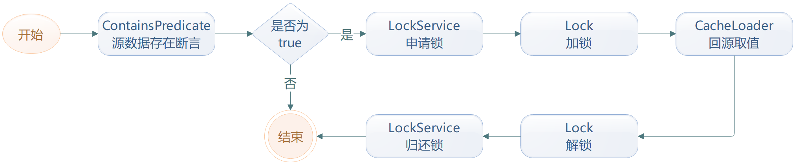

上面这个流程中，我们可以看到只有 `ContainsPredicate`  返回 `true` 时才会加锁回源。

所以，如果想提高程序的执行效率，减少加锁回源次数，较好的方式是实现 `ContainsPredicate` 接口。

---

## 8. 缓存数据刷新

### 8.1. 接口与实现

| 接口           | `CacheRefreshProvider`      | `CacheRefresh`                                      |
| -------------- | --------------------------- | --------------------------------------------------- |
| **内嵌刷新**   | `EmbedCacheRefreshProvider` | `EmbedCacheRefresh`                                 |
| **Redis 刷新** | `RedisCacheRefreshProvider` | `RedisCacheRefresh` `RedisClusterCacheRefresh` |

`CacheRefresh`：记录缓存数据保存信息和删除信息，并定时从数据源加载数据并保存到缓存。

`CacheRefreshProvider`：用于创建 `CacheRefresh` 对象。

`EmbedCacheRefresh`：仅记录当前应用实例的缓存数据操作信息。

`RedisCacheRefresh` & `RedisClusterCacheRefresh`：可记录所有应用实例的缓存数据操作信息。

#### 图示

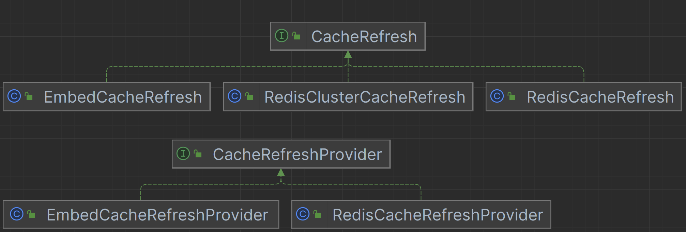

### 8.2. 说明

如果使用 `EmbedCacheRefresh`， 当一个应用有多个实例时，多个实例会独立进行数据刷新。因为同一刷新信息可能存在于多个应用实例，所以可能会重复刷新。

如果使用 `RedisCacheRefresh` ，且 `RedisServer` 是被所有应用实例共享的，那么刷新信息只会保存一份，因此不会重复刷新。

当缓存数据是各应用实例私有的，建议使用 `EmbedCacheRefresh`；当缓存数据是各应用实例共享的，建议使用 `RedisCacheRefresh`。

### 8.3. 优雅停机

当应用停止时，Spring 的 `ShutdownHook` 将会调用 `shutdown` 接口，缓存刷新程序将根据用户配置执行停机策略。

如果仅有内嵌缓存（如 `Caffeine`），建议配置为 `INTERRUPT`，因为即使刷新成功，应用关闭后缓存数据也会全部丢失。

如果有共享缓存（如 `Redis`），可以配置为 `AWAIT`，取消刷新任务有可能会导致缓存数据过期。当然，更好的方式是将数据过期时间配置为数倍于刷新周期，即使一次刷新失败，缓存数据也不会过期，除非是连续多次刷新失败。

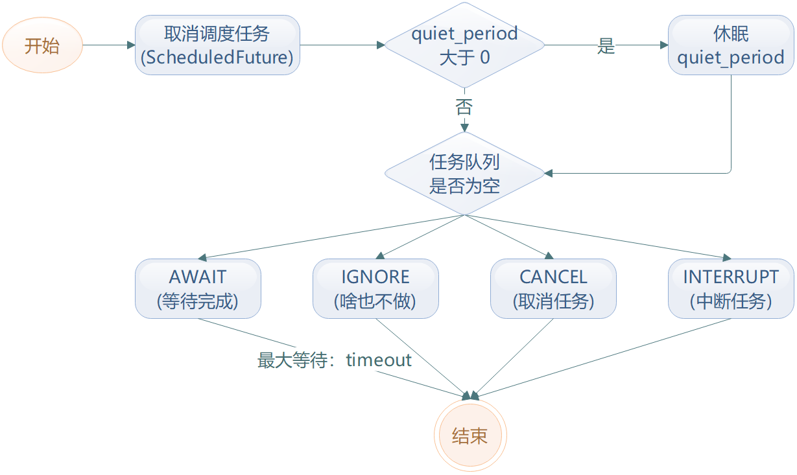

---

## 9. 缓存数据同步

缓存数据同步的目的是为了让各服务实例的私有缓存数据趋于一致。

如果要开启缓存数据同步，至少需要两级缓存：其中一级为私有缓存（如 `Caffeine`），另一级为共享缓存（如被所有服务实例共享的 `Redis`）。

### 9.1. 接口与实现

| 接口       | `CacheSyncProvider`      | `CacheSyncMonitor`     | `MessageListener`     |
| ---------- | ------------------------ | ---------------------- | --------------------- |
|            |                          | `CacheSyncMonitorImpl` | `SyncMessageListener` |
|            |                          | `NoOpCacheSyncMonitor` |                       |
| Redis 实现 | `RedisCacheSyncProvider` |                        |                       |

`CacheSyncMonitor`：负责采集和发送缓存数据变化信息。

`SyncMessageListener`：监听缓存数据同步信息并维护缓存实例的数据。

`CacheSyncProvider`：负责创建 `CacheSyncMonitorImpl` 对象，同步缓存数据变化信息。

`RedisCacheSyncProvider`：使用 `Redis-Stream` 发送和接收缓存数据同步信息。

`CacheSyncMonitorImpl`：`CacheSyncMonitor` 的默认实现。

`NoOpCacheSyncMonitor`：当用户未配置有效的 `CacheSyncProvider`，使用此类以避免空判断。

#### 图示

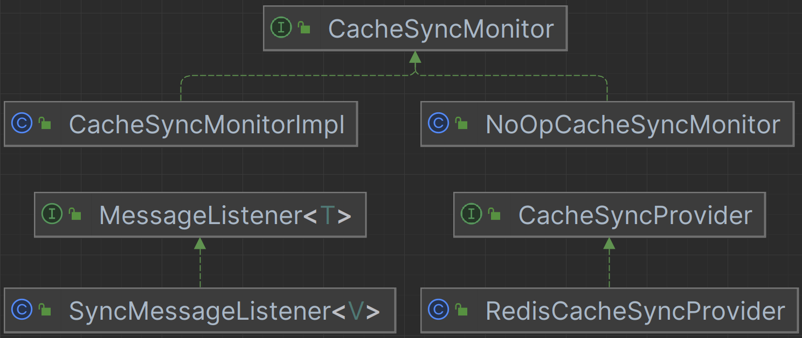

### 9.2. 流程

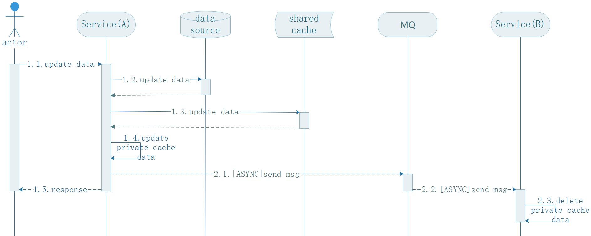

**注意**：

1. `Service(A)` 发送的数据同步信息仅包含 `key`，而不是完整的 `key-value`。
2. `Service(B)` 接收到数据同步信息之后，所做的仅仅是删除旧数据。
3. 当有用户访问 `Service(B)` 获取数据时，`Service(B)` 才会从 `Shared Cache` 读取数据。

### 9.3. 说明

缓存数据同步，并不能保证访问服务实例 A 和 服务实例 B 得到的数据在任意时刻都是一致的。

如：实例 A 的缓存数据变动后，在实例 B 的`SyncMessageListener` 收到消息并完成缓存数据更新之前，实例 B 的返回结果与实例 A 的返回结果是不同的。

如果没有数据同步，那么实例 B 的缓存数据只有等到数据过期重新加载数据后才会与实例 A 的缓存数据一致。

有了缓存数据同步，只是将这个不一致的时间周期缩短。

也就是说，缓存数据同步，采用的是**最终一致性**模型。

如果要实现强一致性，需在缓存数据更新时对所有实例进行加锁，代价太大。

---

## 10. 缓存指标统计

### 10.1.接口与实现

|              | `CacheMetricsProvider`      | `CacheMetricsMonitor`     |
| ------------ | --------------------------- | ------------------------- |
|              |                             | `CacheMetricsMonitorImpl` |
|              |                             | `NoOpCacheMetricsMonitor` |
| 输出到日志   | `LogCacheMetricsProvider`   |                           |
| 输出到 Redis | `RedisCacheMetricsProvider` |                           |

`CacheMetricsMonitor`：负责记录缓存指标信息。

`CacheMetricsProvider`：负责创建 `CacheMetricsMonitor`，与及采集和输出统计指标。

`CacheMetricsMonitorImpl`：默认实现。

`NoOpCacheMetricsMonitor`：当用户未配置有效的 `CacheMetricsProvider`，使用此类以避免空判断。

### 10.2. 说明

无论是输出到日志还是 Redis，`CacheMetricsProvider` 仅负责发送指标统计信息，具体的数据呈现需用户自行实现。

后续，也许会接入 `micrometer`，这样可以更方便地实现数据呈现。

---

## 11. 编解码与压缩

### 11.1. 接口与实现

#### 编解码

| 接口    | `CodecProvider`    | `Codec`                                   | `KeyCodec`                                      |
| ------- | ------------------ | ----------------------------------------- | ----------------------------------------------- |
| JDK     | `JdkCodecProvider` | `JdkCodec`                                | `JdkKeyCodec`                                   |
| Jackson |                    | `GenericJacksonCodec` `JacksonCodec` | `GenericJacksonKeyCodec` `JacksonKeyCodec` |

#### 数据压缩

| 接口      | `CompressorProvider`         | `Compressor`         |
| --------- | ---------------------------- | -------------------- |
| `Deflate` | `DeflaterCompressorProvider` | `DeflaterCompressor` |
| `Gzip`    | `GzipCompressorProvider`     | `GzipCompressor`     |

### 说明

所有键都会通过 `KeyCodec` 转换成 `String` 形式。

值编码与压缩：先编码，后压缩。

值解码与压缩：先解压缩，后解码。

对于内嵌缓存，值编解码和数据压缩都是可选的；对于外部缓存，仅数据压缩是可选的。

---

## 12. 缓存组件管理

### 12.1. 组件容器
`ComponentManager`

所有组件都会按照类别和 ID 注册到 `ComponentManager`，缓存初始化时会根据 ID 从 `ComponentManager` 获取对应实例。

### 12.2. 组件注册

`Register`

所有组件都有 ID，配置时通过 ID 来确定使用的实例对象，因此需要通过 `Register` 将对象实例注册到  `ComponentManager`。

### 12.3 单例模式与延迟加载
`SingletonSupplier`

大多数组件的对象实例注册时使用的是 `SingletonSupplier`。如果有使用，则获取单例对象，如果未使用，则不会初始化对象。

### 12.4 优雅停机
`GracefulShutdown`

对于某些内部需要执行计划任务的对象，又或者是具有连接池的对象，都实现了 `GracefulShutdown` 接口。

---

## 13. 缓存配置生成

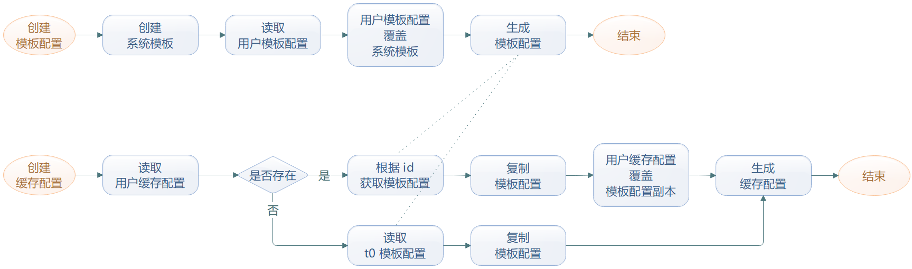

## 14. 继承层级控制

`Xcache` 的实现过程中，一直遵循一个重要原则： “组合优于继承”。

当然，并不是完全不使用继承，而是控制继承层级。

大多数可扩展的功能，都遵循：**接口 → 抽象类 → 实现类** 三个层级。

### 如何避免继承？

#### 辅助类

当多个不同具体实现都需要同一功能时，通过创建 `Helper` 类来组织和管理重复代码块。

如：`CacheHelper`、`RedisHelper`、`RedisClusterHelper`……等。

#### 信息冗余

如果不同实现所需的信息大部分相同，但又有一部分不同，或者无法预知可能需要什么信息，`Xcache` 会通过冗余信息和预留扩展字段来避免继承。

至于依赖于该类的对象，只获取自己需要的信息，再进行对象转换即可。

如：缓存存储配置类（`StoreProps`），`Caffeine` 和 `Redis` 所需的字段有很大一部分相同，但也有一部分不同。

那么， `StoreProps` 的字段是 `CaffeineStore` 和 `RedisStore`所需字段的并集。

同时，未来可能还会有其它的扩展实现，需要未定义的字段，所以 `StoreProps`  增加了 `Map` 结构的扩展字段，可以存储任意类型信息。

#### 对象转换

冗余信息会导致职责不明、难于修改，实际使用时会进行对象类型转换。如：

`RedisStoreProvier` 会将 `StoreProps` 转换成 `RedisConfig`。

`CaffeineStoreProvider` 会将 `StoreProps` 转换成 `CaffeineConfig` 。

#### 对象代理

譬如，为了实现缓存指标统计采集，一种方式是创建 `Store` 的抽象类，在抽象类中添加指标采集，然后所有实现继承该抽象类。

无疑，这会导致功能纠缠和继承层级变多。

因此，`Xcache` 采用了代理方式，通过 `StoreProxy` 来处理与主流程无关的切面逻辑。

