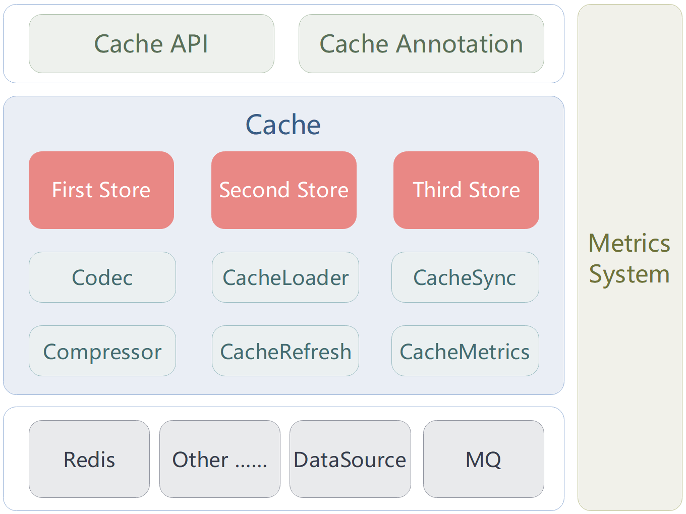
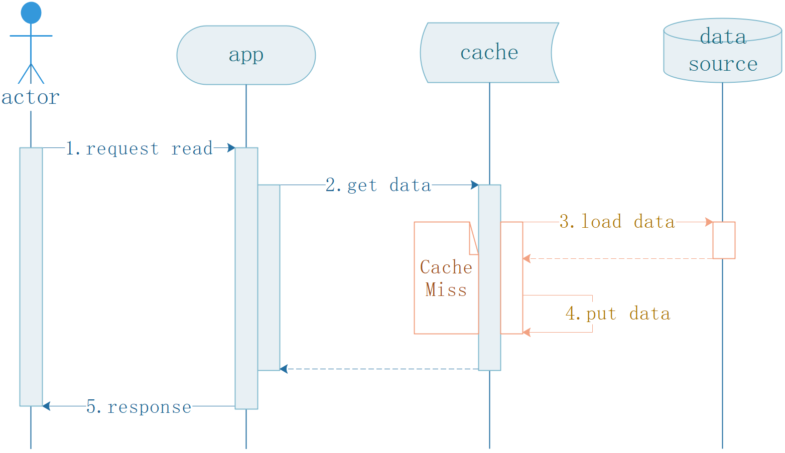
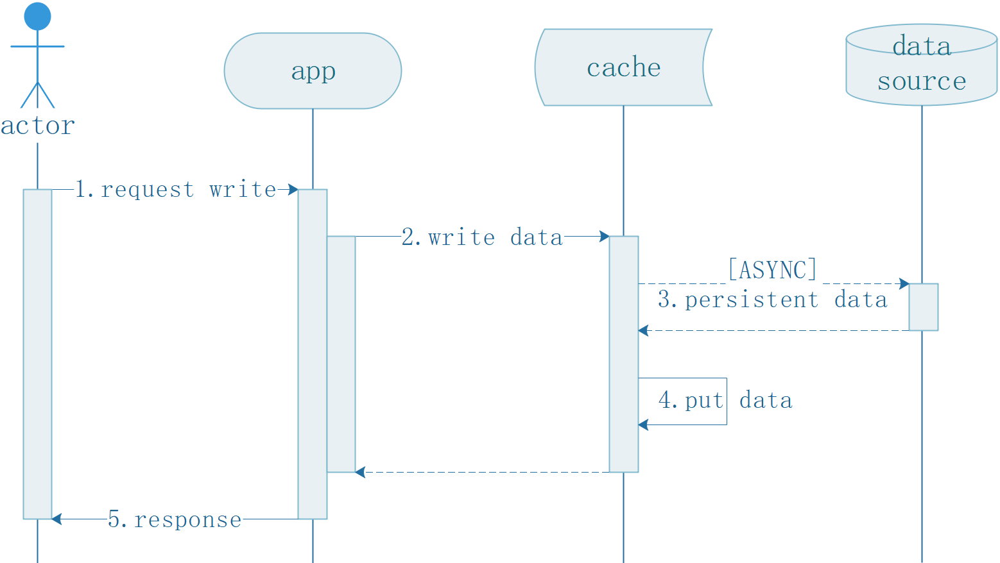

## Xcache  Reference Guide

Author: Patrick.Lau		Version: 1.0.0

## 1. 基本说明

### 1.1. 文档版本

此文档最新版本位于 https://github.com/patricklaux/xcache/blob/main/docs/Reference.md，如您有任何改进，非常欢迎您提交 pr。

### 1.2. 获取帮助

https://github.com/patricklaux/xcache/discussions

如您希望了解如何使用 xcache，或在使用中遇到问题无法解决，欢迎在此提问。

### 1.3. 建议反馈

https://github.com/patricklaux/xcache/issues

如您发现功能缺陷，或有任何开发建议，欢迎在此提交。

如您发现安全漏洞，请私信与我联系。

### 1.4. 项目测试

https://github.com/patricklaux/xcache/tree/main/xcache-test

如您希望扩展实现，又或者对某处代码逻辑有疑问，您可以参考此测试项目，并对相关实现进行调试。

当然，也欢迎您补充更多的测试用例。

## 2. 相关介绍

### 2.1. 简介

Xcache 是易于扩展、功能强大且配置灵活的 Java 多级缓存框架。

### 2.2. 架构



**说明**：

1. Cache：缓存实例。
2. CacheStore：缓存数据存储，每个缓存实例最多可支持三级缓存数据存储。
3. CacheStatMessage：缓存指标统计消息（缓存方法调用次数及结果）。
4. StatCollector：缓存指标统计消息的采集与发布（可选择发布到 log 或 Redis）。
5. CacheSyncMessage：缓存数据同步消息，用于维护各个缓存实例的数据一致性。
6. MQ：消息队列，用于中转数据同步消息或缓存指标统计消息（已有实现采用 Redis Stream）。
7. CacheWriter：数据回写，当缓存数据发生变化时，将数据写入数据源。
8. CacheLoader：回源取值，当缓存无数据或需定期刷新时，从数据源读取数据。
9. dataSource：数据源。

### 2.3. 运行环境

SpringBoot：3.3.0+

JDK：21+

## 3. 项目示例

以下代码片段来自于 [xcache-samples](https://github.com/patricklaux/xcache-samples)，如需获取更详细信息，您可以克隆示例项目到本地进行调试。

```bash
git clone https://github.com/patricklaux/xcache-samples.git
```

### 3.0. Maven bom

Xcache 支持 bom 方式统一管理版本，可在 pom.xml 文件中添加如下配置片段，后续真正引入组件依赖时可省略版本号。

```xml
<dependencyManagement>
    <dependencies>
        <dependency>
            <groupId>com.igeeksky.xcache</groupId>
            <artifactId>xcache-bom</artifactId>
            <version>${xcache.version}</version>
            <type>pom</type>
            <scope>import</scope>
        </dependency>
    </dependencies>
</dependencyManagement>
```

### 3.1. 调用缓存方法

详见 ``xcache-samples-method`` 子项目。

#### 3.1.1 第一步：引入依赖

如直接通过调用方法操作缓存，仅需引入 ``xcache-spring-boot-starter`` 模块。

主要组件：Caffeine（内嵌缓存），Lettuce（Redis 客户端），Jackson（序列化）

```xml
<dependencies>
    <dependency>
        <groupId>com.igeeksky.xcache</groupId>
        <artifactId>xcache-spring-boot-starter</artifactId>
    </dependency>
    <!-- ... other ... -->
</dependencies>
```

#### 3.1.2. 第二步：编写配置

```yaml
xcache: #【1】Xcache 配置的根节点
  group: shop #【2】分组名称（必填），主要用于区分不同的应用
  template: #【3】公共模板配置（必填），列表类型，可配置一至多个
    - id: t0 #【4】模板ID（必填）
      first: #【5】一级缓存配置
        provider: caffeine #【6】使用 id 为 caffeine 的 StoreProvider 作为一级缓存
  cache: #【7】缓存个性配置，列表类型，可配置零至多个
    - name: user #【8】缓存名称，用于区分不同的缓存实例
      template-id: t0 #【9】指定使用的模板为 t0（即【4】中设定的 id）
```

**说明**：

- 同一应用中，一般会有多个不同名称的缓存对象，它们的配置通常大部分相同。

  为了避免填写重复配置，可创建一个公共配置模板【3】，缓存个性配置【9】中则只需填写与该模板的差异部分。

- Xcache 提供了丰富的配置项，绝大多数都有默认值，因此可以省略而无需填写。


#### 3.1.3. 第三步：调用方法

```java
/**
 * 用户缓存服务
 */
@Service
public class UserCacheService {

    private final UserDao userDao;
    private final Cache<Long, User> cache;
    private final CacheLoader<Long, User> cacheLoader;

    public UserCacheService(UserDao userDao, CacheManager cacheManager) {
        this.userDao = userDao;
        this.cache = cacheManager.getOrCreateCache("user", Long.class, User.class);
        this.cacheLoader = new UserCacheLoader(this.userDao);
    }

    /**
     * 获取单个用户信息
     *
     * @param id 用户ID
     * @return 用户信息
     */
    public User getUser(Long id) {
        // 1. 首先查询缓存，如果缓存命中，则直接返回缓存数据；
        // 2. 如果缓存未命中，则调用 cacheLoader 从数据源加载数据。
        return cache.getOrLoad(id, cacheLoader);
    }

    /**
     * 批量获取用户信息
     *
     * @param ids 用户ID集合
     * @return 用户信息集合
     */
    public Map<Long, User> getUsers(Set<Long> ids) {
        // 1. 首先查询缓存，如果缓存全部命中，则直接返回缓存数据；
        // 2. 如果缓存全部未命中或部分命中，则调用 cacheLoader 从数据源加载未命中数据。
        return cache.getAllOrLoad(ids, this.cacheLoader);
    }

    /**
     * 新增用户
     *
     * @param user 新用户信息
     * @return 保存到数据库后返回的用户信息
     */
    public User saveUser(User user) {
        User created = userDao.save(user);
        // 将新增用户信息写入缓存
        cache.put(user.getId(), created);
        return created;
    }

    /**
     * 更新用户信息
     *
     * @param user 待更新的用户信息
     * @return 保存到数据库后返回的用户信息
     */
    public User updateUser(User user) {
        User updated = userDao.update(user);
        // 将更新后的用户信息写入缓存
        cache.put(user.getId(), updated);
        // 如果为了更好地保持数据一致性，这里可选择直接删除缓存数据，后续查询时再从数据源加载
        // cache.evict(user.getId());
        return updated;
    }

    /**
     * 批量更新用户信息
     *
     * @param users 待更新的用户信息集合
     * @return 保存到数据库后返回的用户信息集合
     */
    public Map<Long, User> updateUsers(List<User> users) {
        Map<Long, User> updates = userDao.batchUpdate(users);
        // 将更新后的用户信息写入缓存
        cache.putAll(updates);
        // 如果为了更好地保持数据一致性，这里可选择直接删除缓存数据，后续查询时再从数据源加载
        // cache.evictAll(updates.keySet());
        return updates;
    }

    /**
     * 删除用户信息
     *
     * @param id 用户ID
     */
    public void deleteUser(Long id) {
        userDao.delete(id);
        // 删除缓存数据
        cache.remove(id);
    }

    /**
     * 批量删除用户信息
     *
     * @param ids 用户ID集合
     */
    public void deleteUsers(Set<Long> ids) {
        userDao.batchDelete(ids);
        // 批量删除缓存数据
        cache.removeAll(ids);
    }

    /**
     * 清空数据
     */
    public void clear() {
        userDao.clear();
        // 清空缓存数据
        cache.clear();
    }

    /**
     * CacheLoader 实现类
     * <p>
     * 用于数据回源操作，当缓存中不存在指定数据时，会调用此方法从数据源加载数据。
     *
     * @param userDao
     */
    private record UserCacheLoader(UserDao userDao) implements CacheLoader<Long, User> {

        @Override
        public User load(Long id) {
            return this.userDao.findUser(id);
        }

        @Override
        public Map<Long, User> loadAll(Set<? extends Long> ids) {
            return this.userDao.findUserList(ids);
        }

    }

}
```

提示：

> ``CacheLoader`` 有两个接口：一是 ``load(key)``，用于单个回源取值；二是 ``loadAll(keys)``，用于批量回源取值。
>
> ``cache.getOrLoad(key, cacheLoader)`` 方法，单个回源取值时加锁；
>
> ``cache.getAllOrLoad(keys, cacheLoader)`` 方法，批量回源取值时不加锁，因为批量加锁可能导致死锁。

#### 3.1.4. 小结

此示例演示了如何通过直接调用缓存方法来使用缓存。

缓存方法的使用并不复杂，但大家可能会对编写配置有些许疑惑：

有哪些配置项？有没有默认值？哪些是必填项？哪些是可选项……

鉴于配置项较多，因此写了一个单独章节。欲详细了解，请见 [4.缓存配置](#4. 缓存配置)。

### 3.2. 使用 Xcache 注解

详见 ``xcache-samples-annotation`` 子项目。

#### 3.2.1. 第一步：引入依赖

使用  Xcache 注解，除了需引入 ``xcache-spring-boot-starter``，还需引入 ``xcache-spring-aop``。

```xml
<dependencies>
    <dependency>
        <groupId>com.igeeksky.xcache</groupId>
        <artifactId>xcache-spring-boot-starter</artifactId>
    </dependency>
    <dependency>
        <groupId>com.igeeksky.xcache</groupId>
        <artifactId>xcache-spring-aop</artifactId>
    </dependency>
    <!-- ... other ... -->
</dependencies>
```

#### 3.2.2. 第二步：编写配置

```yaml
xcache: #【1】Xcache 配置的根节点
  group: shop #【2】分组名称（必填），主要用于区分不同的应用
  template: #【3】公共模板配置（必填），列表类型，可配置一至多个
    - id: t0 #【4】模板ID（必填）
      first: #【5】一级缓存配置
        provider: caffeine #【6】使用 id 为 caffeine 的 StoreProvider 作为一级缓存
      second: #【7】二级缓存配置
        provider: lettuce #【8】使用 id 为 lettuce 的 StoreProvider 作为二级缓存（即【14】中设定的 id）
  cache: #【9】缓存个性配置，列表类型，可配置零至多个
    - name: user #【10】缓存名称，用于区分不同的缓存对象
      template-id: t0 #【11】指定使用的模板为 t0（即【4】中设定的模板 id）
  redis: #【12】Redis 配置
    store: #【13】RedisStoreProvider 配置，列表类型，可配置多个
      - id: lettuce #【14】要创建的 RedisStoreProvider 的 id
        factory: lettuce #【15】指定使用的 RedisOperatorFactory 的 id（即【18】中设定的 id）
    lettuce: #【16】Lettuce 客户端配置
      factories: #【17】考虑到一个应用可能会使用多套 Redis，因此采用列表类型，可配置多个
        - id: lettuce #【18】RedisOperatorFactory 唯一标识
          sentinel: #【19】哨兵模式配置
            master-id: mymaster #【20】哨兵主节点名称
            nodes: 127.0.0.1:26379, 127.0.0.1:26380, 127.0.0.1:26381 #【21】哨兵节点列表
```

**说明**：

上一配置文件仅使用 Caffeine 作为一级缓存，这份配置文件则增加了 Redis 作为二级缓存。

1. 首先，【16~21】增加 ``xcache.redis.lettuce`` 配置。

   【18】创建一个 ``RedisOperatorFactory`` 类型的对象，这个对象的 id 设定为 “lettuce”。

   【19】这个 ``RedisOperatorFactory`` 对象用 Lettuce 作为客户端连接 Redis 哨兵节点。

2. 其次，【13~15】增加了 ``xcache.redis.store`` 配置。

   【14】创建一个 ``RedisStoreProvider`` 类型的对象，这个对象的 id 也设定为 “lettuce”。

   【15】``RedisStoreProvider`` 依赖于 ``RedisOperatorFactory``，因此需指定使用的 ``RedisOperatorFactory`` 的 id。

3. 最后，【8】二级缓存指定使用 id 为 "lettuce" 的 ``StoreProvider``。

**常见问题**：

1. **Q**：为什么已经创建了 ``RedisOperatorFactory`` ，还要再创建 ``RedisStoreProvider`` ？

   **A**：``RedisOperatorFactory`` 仅仅是用于提供执行 Redis 命令的客户端（类似于 Spring 的 ``RedisTemplate``）， ``RedisStoreProvider`` 则是缓存数据操作的抽象实现。

   ``RedisOperatorFactory`` 不仅用于缓存数据读写操作，还用于分布式锁、缓存数据同步、缓存数据刷新……等等功能。

2. **Q**：为什么 ``RedisOperatorFactory`` 、 ``RedisStoreProvider`` …… 等配置要设计成列表类型？

   **A**：一个复杂应用连接多套 Redis 服务是比较常见的，设计成列表可以让用户不用再手写配置类来扩展。

   又因为设计成列表，所以需通过 id 来加以区分。

3. **Q**：为什么 id 为 "caffeine" 的 ``StoreProvider`` 并没有通过配置来创建却可以直接使用？

   **A**：因为 ``CaffeineStoreProvider`` 不依赖外部服务，创建该对象也无需任何参数，因此在应用启动时就自动创建了 id 为 “caffeine” 的 ``CaffeineStoreProvider`` 。

   而 ``RedisStoreProvider`` 则依赖于外部服务，又需获取必要的连接信息，且可能有多个实例，因此需显式配置，并通过 id 区分。

#### 3.2.3. 第三步：使用注解

**启用缓存注解：@EnableCache** 

```java
import com.igeeksky.xcache.aop.EnableCache;
import org.springframework.boot.SpringApplication;
import org.springframework.boot.autoconfigure.SpringBootApplication;

/**
 * Xcache 注解示例
 */
// 启用缓存注解
@EnableCache(basePackages = "com.igeeksky.xcache.samples")
@SpringBootApplication(scanBasePackages = "com.igeeksky.xcache.samples")
public class AnnotationApplication {

    public static void main(String[] args) {
        SpringApplication.run(AnnotationApplication.class, args);
    }

}
```

**代码示例** 

```java
// 引入 Xcache 注解
import com.igeeksky.xcache.annotation.*;
// ………… 省略其它

/**
 * 用户缓存服务
 *
 * @author Patrick.Lau
 * @since 1.0.0 2024/9/13
 */
@Service
// 此类中使用了多个 name 为 "user" 的缓存方法注解，因此在此统一配置公共参数。
@CacheConfig(name = "user", keyType = Long.class, valueType = User.class)
public class UserCacheService {

    private final UserDao userDao;

    public UserCacheService(UserDao userDao) {
        this.userDao = userDao;
    }

    /**
     * 获取单个用户信息
     * <p>
     * Cacheable 注解，对应 V value = cache.getOrLoad(K key, CacheLoader<K,V> loader) 方法。
     * <p>
     * 如未配置 key 表达式，采用方法的第一个参数作为缓存键；
     * 如已配置 key 表达式，解析该表达式提取键。
     *
     * @param id 用户ID
     * @return 用户信息
     */
    @Cacheable
    public User getUser(Long id) {
        return userDao.findUser(id);
    }

    /**
     * 获取单个用户信息
     *
     * @param id 用户ID
     * @return Optional<User> – 用户信息
     * 
     * 如方法返回值类型为 Optional，Xcache 将自动采用 Optional.ofNullable(value) 包装返回值。
     */
    @Cacheable
    public Optional<User> getOptionalUser(Long id) {
        User user = userDao.findUser(id);

        // 错误：方法返回值为 Optional 类型时，当用户不存在，直接返回 null
        // return user == null ? null : Optional.of(user);

        // 正确：使用 Optional.ofNullable(value) 包装可能为空的值
        return Optional.ofNullable(user);
    }

    /**
     * 获取单个用户信息
     *
     * @param id 用户ID
     * @return CompletableFuture<User> – 用户信息
     * 
     * 如方法返回值类型为 CompletableFuture，Xcache 将采用 CompletableFuture.completedFuture() 包装返回值。
     */
    @Cacheable
    public CompletableFuture<User> getFutureUser(Long id) {
        User user = userDao.findUser(id);

        // 错误：方法返回值为 CompletableFuture 类型时，当用户不存在，直接返回 null
        // return user == null ? null : CompletableFuture.completedFuture(user);

        // 正确：使用 CompletableFuture.completedFuture 包装可能为空的值
        return CompletableFuture.completedFuture(user);
    }

    /**
     * 批量获取用户信息
     * <p>
     * CacheableAll 注解，对应 Map<K,V> results = cache.getAllOrLoad(Set<K> keys, CacheLoader<K,V> loader) 方法.
     * 
     * 缓存的键集：Set 类型。
     * 如未配置 keys 表达式，采用方法的第一个参数作为键集；
     * 如已配置 keys 表达式，解析该表达式提取键集。
     * 
     * 缓存结果集：Map 类型（方法返回值类型需与其一致）。
     *
     * @param ids 用户ID集合
     * @return Map<Long, User> – 用户信息集合
     */
    @CacheableAll
    public Map<Long, User> getUsers(Set<Long> ids) {
        return userDao.findUserList(ids);
    }

    /**
     * 批量获取用户信息
     *
     * @param ids 用户ID集合
     * @return Optional<Map<Long, User>> – 用户信息集合
     * 
     * 如方法返回值类型为 Optional，Xcache 将采用 Optional.ofNullable(value) 包装返回值。
     */
    @CacheableAll
    public Optional<Map<Long, User>> getOptionalUsers(Set<Long> ids) {
        return Optional.ofNullable(userDao.findUserList(ids));
    }

    /**
     * 批量获取用户信息
     *
     * @param ids 用户ID集合
     * @return CompletableFuture<Map<Long, User>> – 用户信息集合
     * 
     * 如方法返回值类型为 CompletableFuture，Xcache 将采用 CompletableFuture.completedFuture(value) 包装返回值。
     */
    @CacheableAll(keys = "#ids")
    public CompletableFuture<Map<Long, User>> getFutureUsers(Set<Long> ids) {
        return CompletableFuture.completedFuture(userDao.findUserList(ids));
    }

    /**
     * 新增用户信息
     * 
     * CachePut 注解，对应 cache.put(K key, V value) 方法。
     * 
     * 如未配置 key 表达式，采用方法的第一个参数作为缓存键；
     * 如已配置 key 表达式，解析该表达式提取键。
     * 
     * 如未配置 value 表达式，采用方法返回结果作为缓存值；
     * 如已配置 value 表达式，解析该表达式提取值.
     *
     * @param user 用户信息（无ID）
     * @return 用户信息（有ID）
     */
    @CachePut(key = "#result.id")
    public User saveUser(User user) {
        return userDao.save(user);
    }

    /**
     * 更新用户信息
     *
     * @param user 用户信息
     * @return 用户信息
     */
    @CachePut(key = "#user.id", value = "#user")
    public User updateUser(User user) {
        return userDao.update(user);
    }

    /**
     * 批量更新用户信息
     * <p>
     * CachePutAll 注解， 对应 cache.putAll(Map<K,V> keyValues) 方法.
     * <p>
     * 如未配置 keyValues 表达式，默认采用方法返回值；
     * 如已配置 keyValues 表达式，解析该表达式提取键值对集合.
     *
     * @param users 用户信息列表
     * @return Map<Long, User> – 用户信息集合
     */
    @CachePutAll
    public Map<Long, User> updateUsers(List<User> users) {
        return userDao.batchUpdate(users);
    }

    /**
     * 删除用户信息
     * <p>
     * CacheEvict 注解，对应 cache.evict(K key) 方法.
     *
     * @param id 用户ID
     */
    @CacheEvict
    public void deleteUser(Long id) {
        userDao.delete(id);
    }

    /**
     * 批量删除用户信息
     * <p>
     * CacheEvictAll 注解，对应 cache.evictAll(Set<K> keys) 方法.
     *
     * @param ids 用户ID集合
     */
    @CacheEvictAll
    public void deleteUsers(Set<Long> ids) {
        userDao.batchDelete(ids);
    }

    /**
     * 清空数据
     *
     * CacheClear 注解，对应 cache.clear() 方法.
     */
    @CacheClear
    public void clear() {
        userDao.clear();
    }

}
```

#### 3.2.4. 小结

此示例演示了如何使用 Xcache 缓存注解。

1. 公共参数

   Xcache 的方法级缓存注解一共有 7 个：``@Cacheable``，``@CacheableAll``，``@CachePut``，``@CachePutAll``，``@CacheEvict``，``@CacheEvictAll``，``@CacheClear``。

   这些注解均有 5 个参数：name，keyType，keyParams，valueType，valueParams。

   如果一个类中有多个方法级缓存注解，则可以使用类级缓存注解 ``@CacheConfig`` 统一配置公共参数。

2. 每个注解的具体参数配置和逻辑介绍详见 [5. Xcache 注解](#5. Xcache 注解)

3. 返回值类型

   对于 ``@Cacheable`` 和 ``@CacheableAll`` 注解，被注解方法的返回值类型除了需与缓存结果类型保持一致外，还可以是 ``Optional`` 或 ``CompletableFuture`` 类型。

   如果是  ``Optional``  类型，缓存系统会自动用 ``Optional.ofNullable(value)`` 包装缓存中获取到的值。

   如果是 ``CompletableFuture`` 类型，，缓存系统会自动用 ``CompletableFuture.completedFuture(value)``  包装缓存中获取到的值。

   另，Spring cache 注解还支持 Reactor 的 ``Mono`` 和 ``Flux`` 类型，但 Xcache 注解暂无计划支持。因为 JDK 21 已有相对成熟的虚拟线程，再引入更多的抽象似乎并不是一个好主意。
   

### 3.3. 使用 Spring cache 注解

详见 ``xcache-samples-spring-annotation`` 子项目。

如既想用 Spring cache 注解，又想要 Xcache 相对丰富的功能特性，那么，Xcache 提供了  Spring cache 适配模块。

#### 3.3.1. 第一步：引入依赖

使用  Spring cache 注解，除了需引入 ``xcache-spring-boot-starter``，还需引入 ``xcache-spring-adapter-autoconfigure``。

```xml
<dependencies>
    <dependency>
        <groupId>com.igeeksky.xcache</groupId>
        <artifactId>xcache-spring-boot-starter</artifactId>
    </dependency>
    <dependency>
        <groupId>com.igeeksky.xcache</groupId>
        <artifactId>xcache-spring-adapter-autoconfigure</artifactId>
    </dependency>
    <!-- ... other ... -->
</dependencies>
```

#### 3.3.2. 第二步：编写配置

```yaml
xcache: #【1】Xcache 配置的根节点
  group: shop #【2】分组名称（必填），主要用于区分不同的应用
  template: #【3】公共模板配置（必填），列表类型，可配置一至多个
    - id: t0 #【4】模板ID（必填）
      key-codec: jackson-spring #【5】键转为String（需设为适配 Spring cache 的 jackson-spring）
      first: #【6】一级缓存配置
        provider: caffeine #【7】使用 id 为 caffeine 的 StoreProvider 作为一级缓存
      second: #【8】二级缓存配置
        provider: lettuce #【9】使用 id 为 lettuce 的 StoreProvider 作为二级缓存（即【16】中设定的 id）
        value-codec: jackson-spring #【10】值序列化（需设为适配 Spring cache 的 jackson-spring）
  cache: #【11】缓存个性配置，列表类型，可配置零至多个
    - name: user #【12】缓存名称，用于区分不同的缓存对象
      template-id: t0 #【13】指定使用的模板为 t0（即【4】中设定的 id）
  redis: #【14】Redis 配置
    store: #【15】RedisStoreProvider 配置，列表类型，可配置多个
      - id: lettuce #【16】要创建的 RedisStoreProvider 的 id
        factory: lettuce #【17】指定使用的 RedisOperatorFactory 的 id（即【20】中设定的 id）
    lettuce: #【18】Lettuce 客户端配置
      factories: #【19】考虑到一个应用可能会使用多套 Redis，因此采用列表类型，可配置多个
        - id: lettuce #【20】RedisOperatorFactory 唯一标识
          sentinel: #【21】哨兵模式配置
            master-id: mymaster #【22】哨兵主节点名称
            nodes: 127.0.0.1:26379, 127.0.0.1:26380, 127.0.0.1:26381 #【23】哨兵节点列表
```

与上一示例的配置相比，这份配置显式指定了序列化实现：

1. 【5】``key-codec``，需显式设定为适配 Spring cache 的 “jackson-spring”（默认是 “jackson”）。
2. 【10】``value-codec``，需显式设定为适配 Spring cache 的 “jackson-spring”（默认是 “jackson”）。

这是因为 Spring cache 注解无法配置对象类型，因此序列化数据需携带类型信息，这样在反序列化时才能确定对象类型。

譬如示例项目的 ``User`` 对象，当配置为 “jackson-spring” 时，序列化数据会多出 “@class” 属性：

```json
{
    "@class": "com.igeeksky.xcache.samples.User",
    "id": 1,
    "name": "Jack1",
    "age": 18
}
```

> 特别提示：
>
> 使用 Spring cache 注解唯一需要特别修改的就是序列化配置，其余配置完全相同。

#### 3.3.3. 第三步：使用注解

**启用缓存注解：@EnableCaching** 

```java
import org.springframework.boot.SpringApplication;
import org.springframework.boot.autoconfigure.SpringBootApplication;
import org.springframework.cache.annotation.EnableCaching;

/**
 * Spring Cache 注解示例
 */
@EnableCaching
@SpringBootApplication(scanBasePackages = "com.igeeksky.xcache.samples")
public class SpringAnnotationApplication {

    public static void main(String[] args) {
        SpringApplication.run(SpringAnnotationApplication.class, args);
    }

}
```

**代码示例** 

```java
// 引入 Spring cache 注解
import org.springframework.cache.annotation.*;
// ………… 省略其它

/**
 * 用户缓存服务
 */
@Service
// 适配 Spring cache 的 CacheManager 为 springCacheManager，如 Spring 容器内无其它 CacheManager 对象，可不配置。
@CacheConfig(cacheNames = "user", cacheManager = "springCacheManager")
public class UserCacheService {

    private final UserDao userDao;

    public UserCacheService(UserDao userDao) {
        this.userDao = userDao;
    }

    /**
     * 获取单个用户信息
     *
     * @param id 用户ID
     * @return 用户信息
     */
    @Cacheable(key = "#id")
    public User getUser(Long id) {
        return userDao.findUser(id);
    }

    /**
     * 获取单个用户信息
     *
     * @param id 用户ID
     * @return Optional<User> – 用户信息
     */
    @Cacheable(key = "#id")
    public Optional<User> getOptionalUser(Long id) {
        return Optional.ofNullable(userDao.findUser(id));
    }

    /**
     * 获取单个用户信息
     *
     * @param id 用户ID
     * @return CompletableFuture<User> – 用户信息
     */
    @Cacheable(key = "#id")
    public CompletableFuture<User> getFutureUser(Long id) {
        return CompletableFuture.completedFuture(userDao.findUser(id));
    }

    /**
     * 获取单个用户信息
     *
     * @param id 用户ID
     * @return Mono<User> – 用户信息
     * Spring cache 适配 Reactor 的 Mono 类型，因此可以返回 Mono<User>。
     */
    @Cacheable(key = "#id")
    public Mono<User> getMonoUser(Long id) {
        return Mono.fromSupplier(() -> userDao.findUser(id));
    }

    /**
     * 新增用户信息
     *
     * @param user 用户信息
     * @return 用户信息
     */
    @CachePut(key = "#result.id")
    public User saveUser(User user) {
        return userDao.save(user);
    }

    /**
     * 更新用户信息
     *
     * @param user 用户信息
     * @return 用户信息
     */
    @CachePut(key = "#result.id")
    public User updateUser(User user) {
        return userDao.update(user);
    }

    /**
     * 删除用户信息
     *
     * @param id 用户ID
     */
    @CacheEvict(key = "#id")
    public void deleteUser(Long id) {
        userDao.delete(id);
    }

    /**
     * 清空数据
     */
    @CacheEvict(allEntries = true)
    public void clear() {
        userDao.clear();
    }

}
```

#### 3.3.4. 小结

此示例演示了如何引入适配依赖将 Xcache 作为 Spring cache 的接口实现，并通过 Spring cache 注解操作缓存。

1. Spring Cache 没有 ``@CacheableAll``，``@CachePutAll``，``@CacheEvictAll`` 这三个批处理注解。

2. Spring Cache 没有写 key 表达式时，不是使用方法的第一个参数作为键，而是使用所有参数生成 SimpleKey 对象作为键。

3. 对已使用 Spring cache 注解的项目，只需引入 Xcache 相关依赖，几乎不用改动代码，就可将缓存实现替换成 Xcache。


## 4. 缓存配置

作为开源框架项目，关于配置项，我在设计时遵循三个基本原则：

1. 尽可能多配置项：可全面控制缓存的各种功能逻辑，进行缓存性能优化；
2. 尽可能少写配置：通过提供默认值和公共配置模板，减少显式书写配置；
3. 尽可能不改代码：可通过调整配置和增减依赖组件，灵活适配业务逻辑。

### 4.1. 总体介绍

所有配置项大概可分为三部分：一是缓存核心配置，二是 Redis 配置，三是其它配置。

#### 4.1.1. 核心配置

核心配置部分，用于创建 Cache 对象。

Cache 对象可能依赖于“Redis 配置”或“其它配置”中创建的对象。

| 类别            | 名称         | 说明                                                         |
| --------------- | ------------ | ------------------------------------------------------------ |
| xcache.group    | 组名         | 用于区分不同的应用，主要是为了避免键冲突。<br />譬如，当一个 Redis 被多个应用共用，每个应用可设定不同的 group 作为缓存键前缀，从而避免键冲突。 |
| xcache.template | 公共模板配置 | 除了缓存名称外，同一应用的各个缓存实例的其它配置是相似的。<br />因此可配置一个或多个公共模板，从而避免每一个缓存实例重复配置。 |
| xcache.cache    | 缓存个性配置 | 如配置项与公共模板配置完全相同，可以省略全部配置。<br />如配置项与公共模板配置部分不同，只需配置差异部分。 |

**相关配置类**：

| 所在项目                         | 配置类                                            |
| -------------------------------- | ------------------------------------------------- |
| xcache-spring-boot-autoconfigure | com.igeeksky.xcache.autoconfigure.CacheProperties |

#### 4.1.2. Redis 配置

Redis 配置部分，用于创建 Redis 相关的对象。

| 类别                  | 名称                      | 说明                                                         |
| --------------------- | ------------------------- | ------------------------------------------------------------ |
| xcache.redis.charset  | 字符集                    | 用于缓存同步消息、缓存统计消息……编解码                       |
| xcache.redis.store    | Redis 缓存数据存储配置    | 创建 RedisStoreProvider 对象<br />用于缓存数据操作。         |
| xcache.redis.listener | Redis Stream 消息监听配置 | 创建 StreamListenerContainer 对象<br />用于监听 Redis Stream 消息。 |
| xcache.redis.sync     | Redis 缓存数据同步配置    | 创建 RedisCacheSyncProvider 对象                             |
| xcache.redis.lock     | Redis 缓存锁配置          | 创建 RedisCacheLockProvider 对象<br />用于将 Redis 作为分布式锁。 |
| xcache.redis.stat     | Redis 缓存指标统计配置    | 创建 RedisCacheStatProvider 对象<br />用于发送缓存指标数据到 Redis。 |
| xcache.redis.refresh  | Redis 缓存数据刷新配置    | 创建 RedisCacheRefreshProvider 对象<br />使用 Redis 执行缓存数据刷新。 |
| xcache.redis.lettuce  | Lettuce 客户端配置        | 创建 RedisOperatorFactory 对象<br />使用 lettuce 客户端连接 Redis。 |

**相关配置类**：

| 所在项目                                 | 配置类                                                     |
| ---------------------------------------- | ---------------------------------------------------------- |
| xcache-redis-spring-boot-autoconfigure   | com.igeeksky.xcache.autoconfigure.redis.RedisProperties    |
| xcache-lettuce-spring-boot-autoconfigure | com.igeeksky.redis.autoconfigure.lettuce.LettuceProperties |

#### 4.1.3. 其它配置

其它配置部分，用于创建无外部服务依赖的一些对象。

| 类别             | 名称             | 说明                                                         |
| ---------------- | ---------------- | ------------------------------------------------------------ |
| xcache.stat      | 缓存指标统计配置 | 用于创建 LogCacheStatProvider 对象<br />当前 Xcache 的缓存指标统计支持两种输出方式：<br />一是将缓存指标数据输出到日志，二是将缓存指标数据发送到 Redis。<br />此配置项仅用于日志输出方式；如希望使用 Redis 进行指标数据采集，需在 xcache.redis.stat 配置。 |
| xcache.scheduler | 任务调度器配置   | 用于创建 ScheduledExecutorService 对象<br />缓存定时刷新、缓存指标数据定时采集和输出均依赖于此调度器。 |

**相关配置类**：

| 所在项目                         | 配置类                                                |
| -------------------------------- | ----------------------------------------------------- |
| xcache-spring-boot-autoconfigure | com.igeeksky.xcache.autoconfigure.CacheProperties     |
| xcache-spring-boot-autoconfigure | com.igeeksky.xcache.autoconfigure.SchedulerProperties |

#### 4.1.4. 小结

这一章节主要介绍了大的配置类别，具体的细项配置可参见 [4.3.1. 完全配置](#4.3.1. 完全配置)。

如果想继续了解 Xcache 有哪些主要的对象类型，哪些需要配置，哪些无需配置，请参见下一节：[4.2. 对象创建与使用](#4.2. 对象创建与使用)

### 4.2. 对象创建

#### 4.2.1. 对象类型

Cache 对象需要用到不同类型的对象来完成不同的功能。

譬如缓存数据用 Jackson 进行序列化操作，那么就需要先创建一个 ``JacksonCodecProvider`` 对象；

譬如一级缓存用 Caffeine 作为缓存数据存储，那么就需要先创建一个 ``CaffeineStoreProvider`` 对象；

譬如二级缓存用 Redis 作为缓存数据存储，那么就需要先创建一个 ``RedisStoreProvider`` 对象；而 ``RedisStoreProvider`` 对象，又需要用到 ``RedisOperatorFactory``，那么就需要先创建一个 ``RedisOperatorFactory`` 对象。

…………

对象类型汇总信息可见下表：

| 功能           | 接口                    | 实现类                      |       id       | 显式配置 |                      对象依赖                      |
| -------------- | ----------------------- | --------------------------- | :------------: | :------: | :------------------------------------------------: |
| 序列化         | CodecProvider           | JacksonCodecProvider        |    jackson     |    否    |                         无                         |
| 序列化         | CodecProvider           | GenericJacksonCodecProvider | jackson-spring |    否    |                         无                         |
| 序列化         | CodecProvider           | JdkCodecProvider            |      jdk       |    否    |                         无                         |
| 数据压缩       | CompressorProvider      | DeflaterCompressorProvider  |    deflate     |    否    |                         无                         |
| 数据压缩       | CompressorProvider      | GzipCompressorProvider      |      gzip      |    否    |                         无                         |
| 缓存锁         | CacheLockProvider       | EmbedCacheLockProvider      |     embed      |    否    |                         无                         |
| 缓存锁         | CacheLockProvider       | RedisLockProvider           |     自定义     |    是    |                RedisOperatorFactory                |
| 缓存数据刷新   | CacheRefreshProvider    | EmbedCacheRefreshProvider   |     embed      |    否    |              ScheduledExecutorService              |
| 缓存数据刷新   | CacheRefreshProvider    | RedisCacheRefreshProvider   |     自定义     |    是    | RedisOperatorFactory<br />ScheduledExecutorService |
| 缓存指标统计   | CacheStatProvider       | LogCacheStatProvider        |      log       |    否    |              ScheduledExecutorService              |
| 缓存指标统计   | CacheStatProvider       | RedisCacheStatProvider      |     自定义     |    是    | RedisOperatorFactory<br />ScheduledExecutorService |
| 缓存数据同步   | CacheSyncProvider       | RedisCacheSyncProvider      |     自定义     |    是    |              StreamListenerContainer               |
| 缓存存储       | StoreProvider           | CaffeineStoreProvider       |    caffeine    |    否    |                         无                         |
| 缓存存储       | StoreProvider           | RedisStoreProvider          |     自定义     |    是    |                RedisOperatorFactory                |
| 消息监听       | StreamListenerContainer | StreamListenerContainer     |     自定义     |    是    |                RedisOperatorFactory                |
| Redis 命令操作 | RedisOperatorFactory    | LettuceOperatorFactory      |     自定义     |    是    |                         无                         |
| 执行定时任务   | ExecutorService         | ScheduledExecutorService    |       无       |    否    |                         否                         |

**常见问题**：

**Q**：如何判断是否需要显式配置？

**A**：*有外部服务依赖的需要显式配置；无外部服务依赖的无需显式配置*。

譬如，``CaffeineStoreProvider`` 不依赖于外部服务，由 Xcache 自动创建 id 为 "caffeine" 的对象实例。

譬如，``JacksonCodecProvider`` 不依赖于外部服务，由 Xcache 自动创建 id 为 "jackson" 的对象实例。

…………

而，所有 Redis 相关的对象都依赖于外部服务，因此都需要显式配置才会创建对象实例。

譬如，``RedisOperatorFactory`` 需显式设定 id 和 必要的连接信息，才会创建该类型对象。

…………

另，无外部服务依赖的对象，一部分有可选配置，一部分无任何配置。不管有无可选配置，都会根据需要创建对象实例。当然，如果有可选配置，但又未配置，则使用默认参数。

譬如，``LogCacheStatProvider``，有可选配置，可在 ``xcache.stat`` 中配置相关参数。

譬如，``ScheduledExecutorService``，有可选配置，可在 ``xcache.scheduler`` 中配置相关参数。

譬如，``JacksonCodecProvider``，则无任何配置。

…………

**Q**：id 是否能重复？

**A**：*实现同一接口的对象的 id 不能重复*。

Xcache 内部，每个接口类型使用一个 Map  作为对象容器，id 作为键，对象实例作为值。所以，不同接口的对象 id 可以重复，相同接口的对象 id 不能重复。

譬如， ``CaffeineStoreProvider`` 的 id 已经被预设为 "caffeine"，那么  ``RedisStoreProvider`` 就不能再设为 caffeine，因为这两个类都实现了 ``StoreProvider`` 接口。

又譬如， ``RedisOperatorFactory`` 的 id 设为自定义的 "lettuce"，其它如 ``RedisStoreProvider`` ，``RedisLockProvider`` …… 等的 id 也都可以设为 lettuce，因为这些类实现的是不同的接口。

**Q**：为什么有些接口名称的后缀为 “provider” 或 “factory”？

**A**：“provider” 或 “factory” 结尾的是工厂类，真正负责具体功能实现的是通过这些工厂类创建的对象。

创建这些工厂可能需要配置信息，这些工厂创建对象时也可能需要配置信息。

譬如，创建  ``RedisStoreProvider`` 时需指定 ``RedisOperatorFactory`` 的 id（Redis 配置中配置），而  ``RedisStoreProvider`` 创建 ``Store`` 对象时则需用到过期时间等配置信息（核心配置中配置）。

#### 4.2.2. 对象使用

为了更好地说明如何通过配置创建和使用对象，这份配置删除了无关参数，仅保留对象创建和使用信息。

```yaml
xcache: #【1】Xcache 配置的根节点
  group: shop #【2】分组名称 (必填)
  template: #【3】公共模板配置 (必填)
    - id: t0 #【4】模板ID (必填)
      cache-lock: #【5】缓存锁配置
        provider: lettuce #【6】使用 id 为 lettuce 的 LockProvider（即【31】中设定的 id）
      cache-stat: lettuce #【9】使用 id 为 lettuce 的 CacheStatProvider（即【33】中设定的 id）
      cache-refresh: #【10】缓存刷新配置
        provider: lettuce #【11】使用 id 为 lettuce 的 CacheRefreshProvider（即【36】中设定的 id）
      cache-sync: #【7】缓存同步配置
        provider: lettuce #【8】使用 id 为 lettuce 的 CacheSyncProvider（即【39】中设定的 id）
      key-codec: jackson #【12】使用 id 为 jackson 的 CodecProvider（预设id）
      first: #【13】一级缓存配置
        provider: caffeine #【14】使用 id 为 caffeine 的 StoreProvider（预设id）
      second: #【15】二级缓存配置
        provider: lettuce #【16】使用 id 为 lettuce 的 StoreProvider（即【28】中设定的 id）
        value-codec: jackson #【17】使用 id 为 jackson 的 CodecProvider（预设id）
        value-compressor: #【18】值压缩配置
          provider: gzip #【19】使用 id 为 gzip 的 CompressorProvider（预设id）
      third: #【20】三级缓存配置
        provider: none #【21】设置为 none，表示不使用三级缓存
  stat: #【22】LogCacheStatProvider 配置（id 为预设的 log）
    period: 60000 #【23】缓存指标采集的时间间隔
  scheduler: #【24】ScheduledExecutorService 配置
    core-pool-size: 1 #【25】定时任务调度器核心线程数
  redis: #【26】Redis 配置
    store: #【27】RedisStoreProvider 配置
      - id: lettuce #【28】创建 id 为 lettuce 的 RedisStoreProvider
        factory: lettuce #【29】指定使用 id 为 lettuce 的 RedisOperatorFactory（即【47】中设定的 id）
    lock: #【30】RedisLockProvider 配置
      - id: lettuce #【31】创建 id 为 lettuce 的 RedisLockProvider
        factory: lettuce #【32】指定使用 id 为 lettuce 的 RedisOperatorFactory（即【47】中设定的 id）
    stat: #【33】RedisCacheStatProvider 配置
      - id: lettuce #【34】创建 id 为 lettuce 的 RedisCacheStatProvider
        factory: lettuce #【35】指定使用 id 为 lettuce 的 RedisOperatorFactory（即【47】中设定的 id）
    refresh: #【36】RedisCacheRefreshProvider 配置
      - id: lettuce #【37】创建 id 为 lettuce 的 RedisCacheRefreshProvider
        factory: lettuce #【38】指定使用 id 为 lettuce 的 RedisOperatorFactory（即【47】中设定的 id）
    sync: #【39】RedisCacheSyncProvider 配置
      - id: lettuce #【40】创建 id 为 lettuce 的 RedisCacheSyncProvider
        listener: lettuce #【41】指定使用 id 为 lettuce 的 StreamListenerContainer（即【43】中设定的 id）
    listener: #【42】StreamListenerContainer 配置
      - id: lettuce #【43】创建 id 为 lettuce 的 StreamListenerContainer
        factory: lettuce #【44】指定使用 id 为 lettuce 的 RedisOperatorFactory（即【47】中设定的 id）
    lettuce: #【45】Lettuce 客户端配置
      factories: #【46】列表类型，可配置多个
        - id: lettuce #【47】创建 id 为 lettuce 的 RedisOperatorFactory
          standalone: #【48】单机模式 或 副本集模式
            node: 127.0.0.1:6379 #【49】Redis 节点
```

总之，如果要使用某个对象类型作为具体功能实现，那么：

1. 首先，创建这个对象类型的实例：

   无外部服务依赖的由 Xcache 使用预设 id 进行创建；有外部服务依赖的则需由用户显式配置 id 和 必要参数才会创建。

2. 其次，相关功能配置中填写该 id 指定使用该对象实例；

3. 最后，Xcache 内部根据 id 找到该实例并执行相关功能。

### 4.3. 配置示例

1. 除了标注必填的选项，其他选项均为选填，删除或留空表示使用默认配置；
2. 每个配置项均有详细说明，可用 ide 自动提示功能快速查看相关描述信息；
3. 如无法通过 ide 查看描述信息，可查看相关配置类，每一项均有详细注释。

#### 4.3.1. 完全配置

```yaml
xcache:
  group: shop # 分组名称 (必填)
  template: # 公共模板配置 (必填，仅需配置与默认配置不同的部分)，列表类型，可配置多个模板。
    - id: t0 # 模板ID (必填)，建议将其中一个模板的 id 配置为 t0。
      charset: UTF-8 # 字符集 (默认 UTF-8)
      cache-lock: # 缓存锁配置
        provider: lettuce # LockProviderId（默认值：embed）
        initial-capacity: 128 # HashMap 初始容量（）
        lease-time: 1000 # 锁租期 （默认值：1000 毫秒）
        enable-group-prefix: true # 是否添加 group 作为前缀（默认值：true）
        params: # 用于扩展实现的自定义参数，map 类型 （如不使用，请删除，否则会提示参数读取异常）
          test: test
      cache-stat: lettuce # CacheStatProviderId，用于缓存指标信息采集和输出（默认值：log，输出到日志）
      cache-refresh: # 缓存刷新配置
        provider: none # CacheRefreshProviderId（默认值：none，不启用缓存刷新）
        enable-group-prefix: true # 是否添加 group 作为前缀（默认值：true，适用于外部刷新实现）
        refresh-after-write: 3600000 # （默认值：3600000 毫秒）
        refresh-tasks-size: 16384
        refresh-sequence-size: 32
        refresh-thread-period: 10000 # 刷新间隔周期（默认值：10000 毫秒）
        params: # 用于扩展实现的自定义参数，map 类型 （如不使用，请删除，否则会提示参数读取异常）
          test: test
      cache-sync: # 缓存同步配置
        provider: lettuce # CacheSyncProviderId （默认值：none）
        first: true # 一级缓存数据同步（默认值：true，如仅有一级缓存，请改为 false）
        second: false # 二级缓存数据同步（默认值：false）
        enable-group-prefix: true # 是否添加 group 作为前缀（默认值：true）
        max-len: 1000 # 缓存同步队列最大长度 （默认值：10000）
        params: # 用于扩展实现的自定义参数，map 类型 （如不使用，请删除，否则会提示参数读取异常）
          test: test
      key-codec: jackson # 用于将键转换成 String（默认值：jackson）
      first: # 一级缓存配置
        provider: caffeine # StoreProviderId（默认值：caffeine）
        initial-capacity: 65536 # 初始容量（默认值：65536）
        maximum-size: 65536 # 最大容量（默认值：65536）
        maximum-weight: 0 # 最大权重 （默认值：0，如小于等于 0，表示不采用基于权重的驱逐策略）
        key-strength: STRONG # 基于键的引用类型执行驱逐策略（默认值：STRONG）
        value-strength: STRONG # 基于值的引用类型执行驱逐策略（默认值：STRONG）
        expire-after-write: 3600000 # 数据写入后的存活时间（内嵌缓存默认值：3600000 单位：毫秒）
        expire-after-access: 300000 # 数据访问后的存活时间（默认值：300000 单位：毫秒，适用于 caffeine）
        enable-random-ttl: true # 是否使用随机存活时间（默认值：true，避免大量的 key 集中过期）
        enable-null-value: true # 是否允许保存空值（默认值：true）
        value-codec: none # 用于值对象的序列化（内嵌缓存默认值：none，不启用序列化）
        value-compressor: # 值压缩配置，如需启用压缩，必须启用序列化（先序列化后压缩）
          provider: none # CompressorProviderId（默认值：none，不启用数据压缩）
        params: # 用于扩展实现的自定义参数，map 类型 （如不使用，请删除，否则会提示参数读取异常）
          test: test
      second: # 二级缓存配置
        provider: lettuce # StoreProviderId（默认值：none）
        redis-type: STRING # Redis 命令类型（默认：STRING，如无需过期，可设为 HASH）
        expire-after-write: 7200000 # 数据写入后的存活时间（外部缓存默认值：7200000 单位：毫秒）
        enable-group-prefix: true # 是否添加 group 作为前缀（默认值：true，仅适用于外部缓存）
        enable-random-ttl: true # 是否使用随机存活时间（默认值：true，避免大量的 key 集中过期）
        enable-null-value: true # 是否允许保存空值（默认值：true）
        value-codec: jackson # 用于值对象的序列化（外部缓存默认值：jackson）
        value-compressor: # 值压缩配置，如需启用压缩，必须启用序列化（先序列化后压缩）
          provider: none # CompressorProviderId（默认值：none，不启用数据压缩）
          nowrap: false # 是否不携带封装信息（默认值：false，此配置对于 DeflaterCompressor 有效）
          level: 5 # 压缩级别（默认值：-1，此配置对于 DeflaterCompressor 有效）
        params: # 用于扩展实现的自定义参数，map 类型 （如不使用，请删除，否则 spring boot 会提示参数读取异常）
          test: test
      third: # 三级缓存配置
        provider: none # StoreProviderId（三级缓存默认值：none）
        redis-type: STRING # Redis 命令类型（默认：STRING，如无需过期，可设为 HASH）
        expire-after-write: 7200000 # 数据写入后的存活时间（外部缓存默认值：7200000 单位：毫秒）
        enable-group-prefix: true # 是否添加 group 作为前缀（默认值：true，仅适用于外部缓存）
        enable-random-ttl: true # 是否使用随机存活时间（默认值：true，避免大量的 key 集中过期）
        enable-null-value: true # 是否允许保存空值（默认值：true）
        value-codec: jackson # 用于值的序列化（外部缓存默认值：jackson）
        value-compressor: # 值压缩配置
          provider: none # CompressorProviderId（默认值：none，不启用数据压缩）
          nowrap: false # 是否不携带封装信息（默认值：false，此配置对于 DeflaterCompressor 有效）
          level: 5 # 压缩级别（默认值：-1，此配置对于 DeflaterCompressor 有效）
        params: # 用于扩展实现的自定义参数，map 类型 （如不使用，请删除，否则会提示参数读取异常）
          test: test
  cache: # 缓存配置（template 是公共配置，cache 是具体缓存个性配置，仅需配置与对应 template 不同的部分）
    - name: user # 缓存名称
      template-id: t0 # 模板id（默认值：t0，如未配置，默认从 id 为 t0 的模板中复制配置项）
      # …… 其余配置项与模板配置相同，所以直接省略
      # 另，如此缓存配置与 id 为 t0 的模板配置完全相同，name 与 template-id 其实也可以省略。
    - name: order # 缓存名称
      template-id: t0 # 模板id（默认值：t0，如未配置，默认从 id 为 t0 的模板中复制配置项）
      # …… 其余配置项与模板配置相同，所以直接省略
      # 另，如此缓存配置与 id 为 t0 的模板配置完全相同，name 与 template-id 其实也可以省略。
  stat: # 缓存指标统计配置（对象类型为 LogCacheStatProvider，id 为预设的 log）
    period: 60000 # 缓存指标采集的时间间隔（默认值：60000 单位：毫秒）
  scheduler: # 调度器配置
    core-pool-size: 1 # 定时任务调度器核心线程数，如未配置，则使用 (核心数 / 8)，最小为 1。
  redis: # Redis 配置（如不使用 Redis，可直接删除此配置项；如未配置，则不会生成相应的实例对象）
    charset: UTF-8 # 字符集，用于数据同步消息和缓存指标消息的编解码（默认值：UTF-8）
    store: # RedisStoreProvider 配置，列表类型，可配置零至多个
      - id: lettuce #  要创建的 RedisStoreProvider 的 id（必填）
        factory: lettuce # 指定使用的 RedisOperatorFactory 的 id（必填）
    lock: # RedisLockProvider 配置，列表类型，可配置零至多个
      - id: lettuce # 要创建的 RedisLockProvider  的 id（必填）
        factory: lettuce # 指定使用的 RedisOperatorFactory 的 id（必填）
    stat: # RedisCacheStatProvider 配置，列表类型，可配置零至多个
      # 另，RedisCacheStat 只负责发送统计指标信息到指定的 channel，具体的统计汇总需用户自行实现
      - id: lettuce # 要创建的 RedisCacheStatProvider 的 id（必填）
        factory: lettuce # 指定使用的 RedisOperatorFactory 的 id（必填）
        period: 60000 # 缓存指标统计的时间间隔（默认值：60000，单位：毫秒）
        max-len: 10000 # Redis stream 最大长度（默认值：10000，采用近似裁剪，实际长度可能略大于配置值）
        enable-group-prefix: false # 是否附加 group 作为后缀（默认值：false）
    refresh: # RedisCacheRefreshProvider 配置，，列表类型，可配置多个
      - id: lettuce # 要创建的 RedisCacheRefreshProvider 的 id（必填）
        factory: lettuce # 指定使用的 RedisOperatorFactory 的 id（必填）
    sync: # RedisCacheSyncProvider 配置，列表类型，可配置零至多个
      - id: lettuce # 需要创建的 RedisCacheSyncProvider 的 id
        listener: lettuce # （）
    listener: # StreamListenerContainer 配置，列表类型，可配置零至多个
      - id: lettuce # 要创建的 StreamListenerContainer 的 id（必填）
        factory: lettuce # 指定使用的 RedisOperatorFactory 的 id（必填）
        block: 10 # 读取 Stream 时的阻塞时长（默认值： 10 单位：毫秒）
        delay: 1000 # 当次同步任务结束后，下次任务开始前的延迟时长（默认值： 10 单位：毫秒）
        count: 1000 # 同步任务每次从 Stream 读取的最大消息数量（默认值： 1000）
    lettuce: # Lettuce 客户端配置
      factories: # 考虑到一个应用可能会使用多套 Redis，因此采用列表类型，可配置多个
        - id: lettuce # RedisOperatorFactory 唯一标识（默认值：lettuce）
          standalone: # 单机模式 或 副本集模式
            # 这里为了演示 standalone，sentinel，cluster 分别如何配置，所以三种配置都存在，实际只需保留真正使用的其中一种
            # 当三种配置都存在时，那么优先使用 sentinel 配置，其次 cluster，最后 standalone
            node: 127.0.0.1:6379 # Redis 节点，支持 UnixSocket 方式
            nodes: socket:/tmp/redis.sock, 127.0.0.1:6380 # Redis 节点列表
            read-from: # 读节点选择策略（默认值：UPSTREAM，仅从主节点读取数据）
            username: # Redis 用户名
            password: # Redis 密码
            database: 0 # Redis 数据库索引（默认值：0）
            client-name: # Redis 客户端名称
            ssl: false # 是否启用 SSL（默认值：false）
            start-tls: false # 是否启用 TLS（默认值：false）
            ssl-verify-mode: FULL # SSL 验证模式，只有 ssl 配置为 true 时才有意义（默认值：FULL）
            timeout: 60000 # 同步执行命令等待完成的最大时长（默认值：60000 单位：毫秒）
            client-options: # 客户端选项，一般保持默认即可
              auto-reconnect: true # 是否自动重连（默认值：true）
              disconnected-behavior: DEFAULT # 连接断开后是否接受命令（默认值：DEFAULT）
              publish-on-scheduler: false # 是否使用专用的 scheduler 处理 publish 事件（默认值：false）
              ping-before-activate-connection: true # 连接激活前是否发送 PING 消息（默认值：true）
              protocol-version: RESP2 # Redis 协议版本（默认值：RESP3，Redis 6.0 以下请配置为 RESP2）
              suspend-reconnect-on-protocol-failure: # 是否在协议失败时暂停重连（默认值：false）
              request-queue-size: # 请求队列大小 （默认值：Integer.MAX_VALUE）
              socketOptions: # socket 配置选项
                connect-timeout: 10000 # Socket 连接超时（默认值：10000， 单位：毫秒）
                tcp-no-delay: true  # 是否启用 TCP_NODELAY（默认值：true）
                keep-alive: # KeepAlive 配置选项，仅适用于 epoll、 io_uring、Java 11 及之后版本的 NIO
                  enabled: false # 是否启用 KeepAlive（默认值：false）
                  count: 9 # KeepAlive 重试次数（默认值：9）
                  idle: 7200000 # KeepAlive 空闲时间（默认值：7200000， 单位：毫秒）
                  interval: 75000 # KeepAlive 发送间隔（默认值：75000， 单位：毫秒）
                tcp-user-timeout: # TCP_USER_TIMEOUT 配置选项，仅适用于 epoll 和 io_uring
                  enabled: false # 是否启用 TCP_USER_TIMEOUT（默认值：false）
                  tcp-user-timeout: 60000 # TCP 超时配置（默认值：7875000 单位：毫秒）
              ssl-options: # SSL 配置选项，只有 ssl 配置为 true 时才有意义
                ssl-provider: JDK # （默认值：JDK）
                key-store-type: # 密钥库格式（默认值：jks）
                keystore: # 密钥库路径
                keystore-password: # 密钥库密码
                truststore: # 信任库路径
                truststore-password: # 信任库密码
                protocols: # 支持的安全协议
                cipher-suites: # 支持的加密套件
                handshake-timeout: # 握手超时（默认值：10000 单位：毫秒）
              timeout-options: # 命令超时配置选项
                fixedTimeout: # 固定超时时间（默认值：-1，单位：毫秒，无超时配置）
          sentinel: # 哨兵模式配置
            # 这里为了演示 standalone，sentinel，cluster 分别如何配置，所以三种配置都存在，实际只需保留真正使用的其中一种
            # 当三种配置都存在时，那么优先使用 sentinel 配置，其次 cluster，最后 standalone
            master-id: mymaster # 哨兵主节点名称
            nodes: 127.0.0.1:26379, 127.0.0.1:26380, 127.0.0.1:26381 # 哨兵节点列表
            read-from: # 读节点选择策略（默认值：UPSTREAM，仅从主节点读取数据）
            sentinel-username:  # 哨兵用户名
            sentinel-password:  # 哨兵密码
            username:  # Redis 用户名
            password:  # Redis 密码
            database: 0 # Redis 数据库索引（默认值：0）
            client-name: # Redis 客户端名称
            ssl: false # 是否启用 SSL（默认值：false）
            start-tls: false # 是否启用 TLS（默认值：false）
            ssl-verify-mode: FULL # SSL 验证模式，只有 ssl 配置为 true 时才有意义（默认值：FULL）
            timeout:  # 同步执行命令等待完成的最大时长（默认值：60000 单位：毫秒）
            client-options: # 客户端选项，一般保持默认即可，可参考 Lettuce 官方文档
              auto-reconnect: true # 是否自动重连（默认值：true）
              # …… 其余配置省略，可参考 standalone 的相关配置
          cluster: # 集群模式配置
            # 这里为了演示 standalone，sentinel，cluster 分别如何配置，所以三种配置都存在，实际只需保留真正使用的其中一种
            # 当三种配置都存在时，那么优先使用 sentinel 配置，其次 cluster，最后 standalone
            nodes: 127.0.0.1:7001, 127.0.0.1:7002, 127.0.0.1:7003, 127.0.0.1:7004, 127.0.0.1:7005, 127.0.0.1:7006 # 集群节点列表
            read-from: # 读节点选择策略（默认值：UPSTREAM，仅从主节点读取数据）
            username: redis-admin # Redis 用户名
            password: 123456 # Redis 密码
            database: 0 # Redis 数据库索引（默认值：0）
            client-name: # Redis 客户端名称
            ssl: false # 是否启用 SSL（默认值：false）
            start-tls: false # 是否启用 TLS（默认值：false）
            ssl-verify-mode: FULL # SSL 验证模式，只有 ssl 配置为 true 时才有意义（默认值：FULL）
            timeout:  # 同步执行命令等待完成的最大时长（默认值：60000 单位：毫秒）
            client-options: # 集群客户端选项，比一般客户端选项多了重定向、拓扑刷新等配置
              auto-reconnect: true # 是否自动重连（默认值：true）
              # …… 部分配置项省略，可参考 standalone 的相关配置
              max-redirects: # 集群重定向最大重试次数（默认值：5）
              validate-cluster-node-membership: # 是否验证集群节点成员关系（默认值：true）
              node-filter:    # 建立连接的节点[白名单] （如未配置，连接所有节点；如有配置，只连接配置节点）
              topology-refresh-options: # 拓扑刷新配置选项
                adaptive-refresh-triggers: # 动态刷新触发器，列表类型（默认为空集）
                adaptive-refresh-timeout: # 动态刷新超时（默认值：30000 单位：毫秒）
                close-stale-connections: # 是否关闭旧连接（默认值：true）
                dynamic-refresh-sources: # 是否动态刷新节点源（默认值：true）
                periodic-refresh-enabled: # 是否启用周期刷新（默认值：true）
                refresh-period: # 刷新周期 （默认值：30000 单位：毫秒）
                refresh-triggers-reconnect-attempts: # 刷新触发器重连尝试次数（默认值：3）
```

这份完全配置中确实有超多的配置项，实际使用时可以复制这份配置，然后根据需求进行删减。

如果默认配置值与期望值一致，那么直接删除该配置项即可，最后应该会留下比较简洁的配置。

#### 4.3.2. 极简配置

```yaml
xcache:
  group: shop # 分组名称 (必填)
  template: # 公共模板配置 (必填)
    - id: t0 # 模板ID (必填)
```

**说明**：

这份配置设定了 group，并定义了一个公共模板配置，且仅设定了模板 id，其余全部使用默认配置。

那么，这份配置会有什么样的默认逻辑呢？

1. 一级缓存：caffeine，过期时间、缓存空值 …… 等均使用默认值。
2. 二级缓存：无。
3. 三级缓存：无。
4. 缓存个性配置：无，所有缓存实例都完全使用 t0 模板配置。
5. 缓存指标统计：统计数据输出到日志。
6. 缓存数据同步、缓存数据刷新 …… 等：无。


## 5. 缓存注解

这里的缓存注解指的是 Xcache 定义的注解，非 Spring Cache 注解。

### 5.1. @Cacheable

``@Cacheable`` 是方法注解，主要用于查询和保存单个缓存元素。

#### 5.1.1. 相关属性

| 属性        | 必填 | 作用                                                         |
| :---------- | :--: | ------------------------------------------------------------ |
| name        |  否  | 指定缓存名称（如类中无 ``@CacheConfig`` 注解则必须填写）     |
| keyType     |  否  | 指定键类型（如类中无 ``@CacheConfig`` 注解则必须填写）       |
| keyParams   |  否  | 指定键的泛型参数                                             |
| valueType   |  否  | 指定值类型（如类中无 ``@CacheConfig`` 注解则必须填写）       |
| valueParams |  否  | 指定值的泛型参数                                             |
| key         |  否  | SpEL表达式，用于提取键。<br/>如果未配置，使用被注解方法的第一个参数作为键。 |
| condition   |  否  | SpEL表达式，用于判断是否执行缓存逻辑。 <br/>如果未配置，默认为 true。 |

#### 5.1.2. 执行逻辑


### 5.2. @CacheableAll

``@CacheableAll`` 是方法注解，用于批量查询和保存缓存元素。

#### 5.2.1. 相关属性

| 属性        | 必填 | 作用                                                         |
| :---------- | :--: | ------------------------------------------------------------ |
| name        |  否  | 指定缓存名称（如类中无 ``@CacheConfig`` 注解则必须填写）     |
| keyType     |  否  | 指定键类型（如类中无 ``@CacheConfig`` 注解则必须填写）       |
| keyParams   |  否  | 指定键的泛型参数                                             |
| valueType   |  否  | 指定值类型（如类中无 ``@CacheConfig`` 注解则必须填写）       |
| valueParams |  否  | 指定值的泛型参数                                             |
| keys        |  否  | SpEL表达式，用于提取键集。<br/>如果未配置，使用被注解方法的第一个参数作为键。 |
| condition   |  否  | SpEL表达式，用于判断是否执行缓存逻辑。 <br/>如果未配置，默认为 true。 |

#### 5.2.2. 执行逻辑


> 提示：``@Cacheable`` 是加锁执行，``@CacheableAll`` 是不加锁执行。
>
> 如果用唯一的锁则所有批量查询会变成串行；如果为每个键都申请锁则可能导致死锁，因此批量回源查询时不加锁。

### 5.3. @CachePut

``@CachePut`` 是方法注解，用于保存或更新单个缓存元素。

#### 5.3.1. 相关属性

| 属性        | 必填 | 作用                                                         |
| :---------- | :--: | ------------------------------------------------------------ |
| name        |  否  | 指定缓存名称（如类中无 ``@CacheConfig`` 注解则必须填写）     |
| keyType     |  否  | 指定键类型（如类中无 ``@CacheConfig`` 注解则必须填写）       |
| keyParams   |  否  | 指定键的泛型参数                                             |
| valueType   |  否  | 指定值类型（如类中无 ``@CacheConfig`` 注解则必须填写）       |
| valueParams |  否  | 指定值的泛型参数                                             |
| key         |  否  | SpEL表达式，用于提取键。<br/>如果未配置，使用被注解方法的第一个参数作为键。 |
| value       |  否  | SpEL表达式，用于提取值。<br/>如果未配置，使用被注解方法的执行结果作为值。 |
| condition   |  否  | SpEL表达式，用于调用被注解方法前判断是否执行缓存逻辑。 <br/>如果未配置，默认为 true。 |
| unless      |  否  | SpEL表达式，用于调用被注解方法后判断是否执行缓存逻辑。 <br/>如果未配置，默认为 false。 |

#### 5.3.2. 执行逻辑


### 5.4. @CachePutAll

``@CachePutAll`` 是方法注解，用于批量保存或更新缓存元素。

#### 5.4.1. 相关属性

| 属性        | 必填 | 作用                                                         |
| :---------- | :--: | ------------------------------------------------------------ |
| name        |  否  | 指定缓存名称（如类中无 ``@CacheConfig`` 注解则必须填写）     |
| keyType     |  否  | 指定键类型（如类中无 ``@CacheConfig`` 注解则必须填写）       |
| keyParams   |  否  | 指定键的泛型参数                                             |
| valueType   |  否  | 指定值类型（如类中无 ``@CacheConfig`` 注解则必须填写）       |
| valueParams |  否  | 指定值的泛型参数                                             |
| keyValues   |  否  | SpEL表达式，用于提取键值对集。<br/>如果未配置，使用被注解方法的第一个参数作为键值对集。 |
| condition   |  否  | SpEL表达式，用于调用被注解方法前判断是否执行缓存逻辑。 <br/>如果未配置，默认为 true。 |
| unless      |  否  | SpEL表达式，用于调用被注解方法后判断是否执行缓存逻辑。 <br/>如果未配置，默认为 false。 |

#### 5.4.2. 执行逻辑


### 5.5. @CacheEvict

``@CacheEvict`` 是方法注解，用于驱逐单个缓存元素。

#### 5.5.1. 相关属性

| 属性             | 必填 | 作用                                                         |
| :--------------- | :--: | ------------------------------------------------------------ |
| name             |  否  | 指定缓存名称（如类中无 ``@CacheConfig`` 注解则必须填写）     |
| keyType          |  否  | 指定键类型（如类中无 ``@CacheConfig`` 注解则必须填写）       |
| keyParams        |  否  | 指定键的泛型参数                                             |
| valueType        |  否  | 指定值类型（如类中无 ``@CacheConfig`` 注解则必须填写）       |
| valueParams      |  否  | 指定值的泛型参数                                             |
| key              |  否  | SpEL表达式，用于提取键。<br/>如果未配置，使用被注解方法的第一个参数作为键。 |
| condition        |  否  | SpEL表达式，用于调用被注解方法前判断是否执行缓存逻辑。 <br/>如果未配置，默认为 true。 |
| unless           |  否  | SpEL表达式，用于调用被注解方法后判断是否执行缓存逻辑。 <br/>如果未配置，默认为 false。 |
| beforeInvocation |  否  | 如果为 true，调用被注解方法前驱逐缓存元素；如果为 false，调用被注解方法后驱逐缓存元素。 <br/>如果未配置，默认为 false。 |

#### 5.5.2. 执行逻辑


### 5.6. @CacheEvictAll

``@CacheEvictAll`` 是方法注解，用于批量驱逐缓存元素。

#### 5.6.1. 相关属性

| 属性             | 必填 | 作用                                                         |
| :--------------- | :--: | ------------------------------------------------------------ |
| name             |  否  | 指定缓存名称（如类中无 ``@CacheConfig`` 注解则必须填写）     |
| keyType          |  否  | 指定键类型（如类中无 ``@CacheConfig`` 注解则必须填写）       |
| keyParams        |  否  | 指定键的泛型参数                                             |
| valueType        |  否  | 指定值类型（如类中无 ``@CacheConfig`` 注解则必须填写）       |
| valueParams      |  否  | 指定值的泛型参数                                             |
| keys             |  否  | SpEL表达式，用于提取键集。<br/>如果未配置，使用被注解方法的第一个参数作为键集。 |
| condition        |  否  | SpEL表达式，用于调用被注解方法前判断是否执行缓存逻辑。 <br/>如果未配置，默认为 true。 |
| unless           |  否  | SpEL表达式，用于调用被注解方法后判断是否执行缓存逻辑。 <br/>如果未配置，默认为 false。 |
| beforeInvocation |  否  | 如果为 true，调用被注解方法前驱逐缓存元素；如果为 false，调用被注解方法后驱逐缓存元素。 <br/>如果未配置，默认为 false。 |

#### 5.6.2. 执行逻辑


### 5.7. @CacheClear

``@CacheClear`` 是方法注解，用于清空所有缓存数据。

#### 5.7.1. 相关属性

| 属性             | 必填 | 作用                                                         |
| :--------------- | :--: | ------------------------------------------------------------ |
| name             |  否  | 指定缓存名称（如类中无 ``@CacheConfig`` 注解则必须填写）     |
| keyType          |  否  | 指定键类型（如类中无 ``@CacheConfig`` 注解则必须填写）       |
| keyParams        |  否  | 指定键的泛型参数                                             |
| valueType        |  否  | 指定值类型（如类中无 ``@CacheConfig`` 注解则必须填写）       |
| valueParams      |  否  | 指定值的泛型参数                                             |
| condition        |  否  | SpEL表达式，用于调用被注解方法前判断是否执行缓存逻辑。 <br/>如果未配置，默认为 true。 |
| unless           |  否  | SpEL表达式，用于调用被注解方法后判断是否执行缓存逻辑。 <br/>如果未配置，默认为 false。 |
| beforeInvocation |  否  | 如果为 true，调用被注解方法前驱逐缓存元素；如果为 false，调用被注解方法后驱逐缓存元素。 <br/>如果未配置，默认为 false。 |

#### 5.7.2. 执行逻辑


### 5.8. @CacheConfig

``@CacheConfig`` 是类注解，用于配置公共属性。

#### 5.8.1. 相关属性

| 属性        | 必填 | 作用             |
| :---------- | :--: | ---------------- |
| name        |  是  | 指定缓存名称     |
| keyType     |  是  | 指定键类型       |
| keyParams   |  否  | 指定键的泛型参数 |
| valueType   |  是  | 指定值类型       |
| valueParams |  否  | 指定值的泛型参数 |

> ``@Cacheable``，``@CacheableAll`` …… 等所有缓存方法注解均有这五个公共属性。
>
> 如果一个类中有同名缓存的多个缓存方法注解，那么可以在类中添加 ``@CacheConfig`` 注解，避免重复配置公共属性。

#### 5.8.2. 执行逻辑


1. 公共属性完整性

   ``@CacheConfig`` 的 name 、keyType、valueType 是必填属性。

   缓存方法注解中，name 、keyType、valueType 并非必填属性，但如果类中没有 ``@CacheConfig`` 注解，则必须填写，否则报异常。

2. 公共属性一致性

   如果缓存方法注解中有配置 keyType、keyParams、valueType、valueParams 任意其中一个或多个属性，但类中又有同名缓存的 ``@CacheConfig`` 注解，则这些公共属性值必须一致，否则报异常。

   因此，如果类中有同名缓存的 ``@CacheConfig`` 注解，缓存方法注解中的公共属性建议留空。

3. 如果缓存方法注解的 name 属性值未配置或与 ``@CacheConfig`` 的相同，则表示两者指向的是同一个缓存实例。


### 5.9. @EnableCache

``@EnableCache`` 是类注解，用于启用 Xcache 缓存注解功能。

| 属性         | 必填 |          默认值           | 作用                                                         |
| :----------- | :--: | :-----------------------: | ------------------------------------------------------------ |
| basePackages |  是  |            无             | 指定需要扫描缓存注解的包路径                                 |
| order        |  否  | Ordered.LOWEST_PRECEDENCE | 指定切面优先级                                               |
| AdviceMode   |  否  |     AdviceMode.PROXY      | 指定代理模式<br />当前仅支持 AdviceMode.PROXY，不支持 AdviceMode.ASPECTJ。 |

### 5.10. 其它事项

#### 5.10.1. condition 与 unless

condition 默认为 true，该表达式是在调用被注解方法之前进行解析，只有解析结果为 true，才会执行缓存相关逻辑。

unless 默认为 false，该表达式是在调用被注解方法之后进行解析，只有解析结果为 false，才会执行缓存相关逻辑。

由于 condition 先于 unless 进行条件判断，因此如果 condition 为 false，将直接忽略 unless，一定不会执行缓存逻辑。

另：@Cacheable 和 @CacheableAll 无 unless 属性。

#### 5.10.2. 注解互斥

@Cacheable 和 @CacheableAll，当缓存命中（全部）数据时，将不执行被注解方法，因此不能与其它缓存注解共用于同一方法。

#### 5.10.3. 方法参数名

如注解的表达式有用到方法参数名，项目编译时需添加参数 ``-parameters``。

如使用 Maven 进行编译，可参考如下示例：

```xml
<plugin>
    <groupId>org.apache.maven.plugins</groupId>
    <artifactId>maven-compiler-plugin</artifactId>
    <version>${maven.compiler.version}</version>
    <configuration>
        <source>${maven.compiler.source}</source>
        <target>${maven.compiler.target}</target>
        <encoding>${maven.compiler.encoding}</encoding>
        <!--如果注解的表达式有用到方法参数名，需添加此编译选项并设为 true -->
        <parameters>true</parameters>
    </configuration>
</plugin>
```

如不想添加编译参数，则需使用 【#a + index】 的方式来获取方法参数。

```java
// #a0 或 #p0 表示获取方法的第 1 个参数，#a1 或 #p1 表示获取方法的第 2 个参数，如此类推。
@CachePut(key = "#a0", value = "#a1")
//@CachePut(key = "#p0", value = "#p1")
public void save(long id, User user) {
    // do something
}
```

#### 5.10.4. result

如表达式计算是在被注解方法执行之后，被注解方法的执行结果将使用 “result” 关键字保存到表达式计算的上下文环境，表达式中可使用 “#result” 来提取被注解方法执行结果。

需要注意的是，如果被注解方法中存在命名为 “result” 的参数，那么：

如表达式计算是在被注解方法执行之前，“#result” 获取到的是被注解方法的参数变量；
如表达式计算是在被注解方法执行之后，“#result” 获取到的是被注解方法的返回结果。

```java
/**
 * 此示例，"#result" 获取到的是方法返回结果，而不是参数中的 result。
 * 因为 @CachePut 的表达式计算和缓存逻辑执行是在方法执行之后。
 */
@CachePut(value = "#result")
public User save(long id, User result) {
    return new User(1, "MethodResult", 18);
}
```

如果参数命名为 result，又希望表达式中使用该参数，那么可使用 【#a+index】 或 【#p+index】 来获取参数中的值。

```java
@CachePut(value = "#a1")
//@CachePut(value = "#p1")
public User save(long id, User result) {
    return new User(1, "MethodResult", 18);
}
```

## 6. 缓存接口

缓存核心接口位于 ``com.igeeksky.xcache.common.cache``：

### 6.1. 主要接口

```java
    /**
     * 根据键从缓存中读取值（返回值为原始值）
     */
    V get(K key);

	/**
     * 根据键从缓存中读取值（返回值为包装类）
     */
    CacheValue<V> getCacheValue(K key);

	/**
     * 1. 先从缓存取值，如果缓存有命中，返回已缓存的值；
     * 2. 如果缓存未命中，则通过方法传入的 cacheLoader 回源取值，取值结果先存入缓存，最后返回该值。
     * 
     * 注：回源取值时将加锁执行。
     */
    V getOrLoad(K key, CacheLoader<K, V> cacheLoader);

	/**
     * 1. 先从缓存取值，如果缓存有命中，返回已缓存的值。
     * 2. 如果缓存未命中，通过缓存内部的 cacheLoader 回源取值，取值结果存入缓存并返回；
     * 
     * 注1：回源取值时将加锁执行。
     * 注2：如果缓存内部无 CacheLoader，将抛出异常。
     */
    V getOrLoad(K key);

	/**
     * 根据键集从缓存中读取值（返回值为原始值）
     */
    Map<K,V> getAll(Set<? extends K> keys);

	/**
     * 根据键集从缓存中读取值（返回值为包装类）
     */
    Map<K, CacheValue<V>> getAllCacheValues(Set<? extends K> keys);

    /**
     * 1. 先从缓存取值，如果缓存命中全部数据，返回缓存数据集。
     * 2. 如果缓存有未命中数据，通过方法传入的 cacheLoader 回源取值，取值结果先存入缓存，最后返回合并结果集：缓存数据集+回源取值结果集。
     * 注：批量回源取值不加锁。
     */
    Map<K,V> getAllOrLoad(Set<? extends K> keys, CacheLoader<K, V> cacheLoader);

    /**
     * 1. 先从缓存取值，如果缓存命中全部数据，返回缓存数据集。
     * 2. 如果有缓存未命中数据，通过缓存内部的 cacheLoader 回源取值，取值结果先存入缓存，最后返回合并结果集：缓存数据集+回源取值结果集。
     * 
     * 注1：批量回源取值不加锁；
     * 注2：如果缓存内部无 CacheLoader，将抛出异常。
     */
    Map<K,V> getAllOrLoad(Set<? extends K> keys);

	/**
     * 将单个键值对存入缓存
     */
    void put(K key, V value);

    /**
     * 将多个键值对存入缓存
     */
    void putAll(Map<? extends K, ? extends V> keyValues);

    /**
     * 根据键将数据逐出缓存
     */
    void remove(K key);

    /**
     * 根据键集将数据逐出缓存
     */
    void removeAll(Set<? extends K> keys);

    /**
     * 清空缓存中的所有数据
     */
    void clear();
```

### 6.2. 关于空值

#### 空值问题

缓存查询接口 ``V get(K key)``，那么当返回值为 ``null`` 时，会有语义模糊：

1. 可能是数据源无该数据；
2. 可能是还未缓存该数据。

为了确定数据源是否有该数据，调用者需查询数据源。

每次返回 ``null`` ，为了确定数据源是否有值，都需回源查询，这无疑会大大增加数据源压力。

#### 解决方案

Xcache 被设计为可缓存空值，``CacheValue`` 是缓存值的包装类。

当使用缓存查询接口 ``CacheValue<V> getCacheValue(K key)`` 时，可通过 ``cacheValue`` 是否为 ``null`` 来判断是否还未缓存该数据。

```java
CacheValue<User> cacheValue = cache.get(id);
if (cacheValue == null) {
    // 未缓存，从数据源读取数据
    User user = userDao.find(id);
    // 取值结果存入缓存，如果缓存设置成允许缓存空值，那么下次查询时 cacheValue 将不为 null
    cache.put(id, user);
    // do something
 } else {
     if (cacheValue.hasValue()){
         // 已缓存，数据源有数据
         User user = cacheValue.getValue();
         // do something
     } else {
         // 已缓存，数据源无数据（无需再回源确认）
         // do something
     }
 }
```

只有 ``cacheValue == null`` 时，才需回源取值，因此可以减少回源次数。

其它接口如 ``Map<K, CacheValue<V>> getAll(Set<? extends K> keys)``，关于 ``cacheValue`` 的语义也是如此。

> 注：
>
> 通过 ``cacheValue`` 是否为 ``null`` 来决定是否回源取值，需将该缓存实例配置为允许缓存空值。
>
> 即，缓存实例至少有一级的缓存数据存储的  ``enable-null-value`` 配置项为 ``true``（默认为  ``true``）。

## 7. 功能扩展

Xcache 提供了一些功能扩展接口，用于支持不同的缓存模式和特定功能。

### 7.1. 回源取值

#### 7.1.1. CacheLoader

``CacheLoader`` 主要用于实现 read-through 模式，其接口定义如下：

```java
/**
 * 回源取值，用于从数据源读取数据
 *
 * @param <K> 键类型
 * @param <V> 值类型
 */
@FunctionalInterface
public interface CacheLoader<K, V> {

    /**
     * 单个回源取值
     *
     * @param key 要回源取值的键
     * @return 如果有值，返回值；如果无值，返回 null
     */
    V load(K key);

    /**
     * 批量回源取值
     *
     * @param keys 要回源取值的键集
     * @return 返回键值对集合，不能返回 null
     */
    default Map<K, V> loadAll(Set<? extends K> keys) {
        Map<K, V> map = Maps.newHashMap(keys.size());
        for (K key : keys) {
            V value = load(key);
            if (value != null) {
                map.put(key, value);
            }
        }
        return map;
    }

}
```

#### 7.1.2. 用法示例

**实现类**：

```java
public record UserCacheLoader(UserDao userDao) implements CacheLoader<Long, User> {

    @Override
    public User load(Long id) {
        return this.userDao.findUser(id);
    }

    @Override
    public Map<Long, User> loadAll(Set<? extends Long> ids) {
        return this.userDao.findUserList(ids);
    }

}
```

**用法示例一**：

```java
@Service
public class UserCacheService {

    private final Cache<Long, User> cache;
    private final CacheLoader<Long, User> cacheLoader;

    public UserCacheService(UserDao userDao, CacheManager cacheManager) {
        this.cache = cacheManager.getOrCreateCache("user", Long.class, User.class);
        this.cacheLoader = new UserCacheLoader(userDao);
    }

    /**
     * 根据用户ID获取单个用户信息
     *
     * @param id 用户ID
     * @return 用户信息
     */
    public User getUser(Long id) {
        // 1. 首先查询缓存，如果缓存命中，则直接返回缓存数据；
        // 2. 如果缓存未命中，则由缓存直接调用 cacheLoader 从数据源加载数据。
        return cache.getOrLoad(id, cacheLoader);
    }

    /**
     * 根据用户ID批量获取用户信息
     *
     * @param ids 用户ID集合
     * @return 用户信息集合
     */
    public Map<Long, User> getUsers(Set<Long> ids) {
        // 1. 首先查询缓存，如果缓存全部命中，则直接返回缓存数据；
        // 2. 如果缓存全部未命中或部分命中，则调用 cacheLoader 从数据源加载未命中数据。
        return cache.getAllOrLoad(ids, this.cacheLoader);
    }

}
```

**用法示例二**：

1、``UserCacheLoader`` 作为 bean 对象注入到 spring 容器。

> CacheManager 创建 Cache 对象时，会根据缓存名称查找对应的 CacheLoader，如果与 Cache 同名的 CacheLoader 存在，则将其设为该 Cache 对象的属性。

```java
@Configuration
@AutoConfigureBefore(CacheAutoConfiguration.class)
public class CacheLoaderAutoConfiguration {

    @Bean
    CacheLoaderHolder userCacheLoader(UserDao userDao) {
        // 创建一个 CacheLoaderHolder
        CacheLoaderHolder holder = new CacheLoaderHolder();
        // 将 UserCacheLoader 放入到 holder，键为缓存名称 “user”。
        holder.put("user", new UserCacheLoader(userDao));
        return holder;
    }

}
```

2、查询数据时，改为调用 ``cache.getOrLoad(key)`` 或 ``cache.getAllOrLoad(keys)`` 方法。

当缓存未命中时，Cache 对象将调用内部的 ``CacheLoader`` 从数据源读取数据然后再存入缓存。

> 注意：调用这两个方法时，如果 CacheLoader 不存在，将抛出异常。

```java
@Service
public class UserCacheService {

    private final Cache<Long, User> cache;

    public UserCacheService(CacheManager cacheManager) {
        // 创建名称为 "user" 的 Cache 对象
        this.cache = cacheManager.getOrCreateCache("user", Long.class, User.class);
    }

    /**
     * 获取单个用户信息
     *
     * @param id 用户ID
     * @return 用户信息
     */
    public User getUser(Long id) {
        // 1. 首先查询缓存，如果缓存命中，则直接返回缓存数据；
        // 2. 如果缓存未命中，则由缓存调用内部的 cacheLoader 从数据源加载数据，然后存入缓存。
        return cache.getOrLoad(id);
    }

    /**
     * 批量获取用户信息
     *
     * @param ids 用户ID集合
     * @return 用户信息集合
     */
    public Map<Long, User> getUsers(Set<Long> ids) {
        // 1. 首先查询缓存，如果缓存全部命中，则直接返回缓存数据；
        // 2. 如果存在未命中数据，则调用 cache 对象内部的 cacheLoader 从数据源加载。
        return cache.getAllorLoad(ids);
    }

}
```

#### 7.1.3. 小结

以上两个示例中，一是使用方法中传入的 ``CacheLoader`` 回源取值，二是使用注入的 ``CacheLoader`` 回源取值。

这两种方式的使用效果是完全一致的，且两种方式可以混用，用户可以根据业务场景和编程喜好自由选择。

另，如果希望使用缓存数据刷新功能，则必须通过自动配置注入 ``CacheLoader``。

### 7.2. 数据回写

#### 7.2.1. CacheWriter

``CacheWriter`` 主要用于实现 write-through 和 write-behind 模式。

Cache 内部在操作（保存、删除）缓存数据之前，如果存在 ``CacheWriter`` 对象，则调用其对应方法将数据更新到数据源。

其接口定义如下：

```java
/**
 * 数据回写：缓存数据写入数据源
 * <p>
 * 如果实现类同步写入数据源，则为 write-through 模式；
 * 如果实现类异步写入数据源，则为 write-behind 模式。
 *
 * @param <K> 键类型
 * @param <V> 值类型
 */
public interface CacheWriter<K, V> {

    /**
     * 删除数据源的数据
     * <p>
     * 调用 Cache.remove(key) 方法时，会调用此方法
     *
     * @param key 缓存键
     */
    void delete(K key);

    /**
     * 批量删除数据源的数据
     * <p>
     * 调用 Cache.removeAll(keys) 方法时，会调用此方法
     *
     * @param keys 缓存键集合
     */
    void deleteAll(Set<? extends K> keys);

    /**
     * 数据存入数据源
     * <p>
     * 调用 Cache.put(key, value) 方法时，会调用此方法
     *
     * @param key   缓存键
     * @param value 缓存值
     */
    void write(K key, V value);

    /**
     * 批量存入数据源
     * <p>
     * 调用 Cache.putAll(keyValues) 方法时，会调用此方法
     *
     * @param keyValues 缓存键值对集合
     */
    void writeAll(Map<? extends K, ? extends V> keyValues);

}
```

#### 7.2.1. 用法示例

``CacheWriter`` 的实现类作为 bean 对象注入到 spring 容器。

> ``CacheManager`` 创建 Cache 对象时，会采用缓存名称查找 ``CacheWriter``，如果与 Cache 同名的 ``CacheWriter`` 存在，则将其设为该 Cache 对象的内部属性。

```java
@Configuration
// 此对象的自动配置需要在创建 CacheManager 之前
@AutoConfigureBefore(CacheAutoConfiguration.class)
public class CacheWriterAutoConfiguration {

    /**
     * @param UserBloomFilter 用于判断用户 id 是否存在
     * 完整的 BloomFilter 实现比较复杂，譬如要考虑 BloomFilter 的实现方式，数据更新的实时性问题等……
     * 因为跟业务场景强相关，这里仅仅是起个便于理解的名字而已，不作具体实现
     * 另，不用 BloomFilter，用 Set 等其它数据结构也是可以的
     */
    @Bean
    CacheWriterHolder userCacheWriter(UserDao userDao) {
        // 创建一个 CacheWriterHolder，其作用是建立缓存名称 与 CacheWriter 的一一对应关系
        CacheWriterHolder holder = new CacheWriterHolder();
        
        // 将 CacheWriter 放入到 holder，键为缓存名称 “user”。
        holder.put("user", new CacheWriter<Long, User>(){

            @Override
            public void delete(Long id){
                // 同步（如果是同步，则为 write-through 模式）
                userDao.deleteById(id);
                // 异步（如果是异步，则为 write-behind 模式）
                // Thread.ofVirtual().start(() -> userDao.deleteById(id));
            }

            @Override
            public void deleteAll(Set<Long> ids){
                // 同步
                userDao.deleteAllByIds(ids);
                // 异步
                // ……
            }

            @Override
            public void write(Long id, User user){
                // 同步
                userDao.saveOrUpdate(id, user);
                // 异步
                // ……
            }

            @Override
            public void writeAll(Map<Long, User> keyValues){
                // 同步
                userDao.saveOrUpdate(id, user);
                // 异步
                // ……
            }

        });
        return holder;
    }

}
```

用户仅需将 ``CacheWriter`` 实现类作为 bean 注入到 Spring 容器，具体使用由 Cache 对象内部自动处理。

> 另，需特别注意的是：
>
> 如果是异步写，当 ``CacheWriter`` 写失败时，需有重试机制；
>
> 如果是同步写，当 ``CacheWriter`` 写失败时，需抛出异常。

### 7.3. 存在断言

#### 7.3.1. ContainsPredicate

cache 内部在调用 ``CacheLoader`` 之前，如果存在 ``ContainsPredicate``，先调用  ``ContainsPredicate``  判断数据源是否存在该数据，只有为 ``true`` 时才会调用 ``CacheLoader``，其接口定义如下：

```java
/**
 * 判断数据源是否有值 <p>
 * 作用：处理缓存穿透问题 <p>
 * 譬如：预读取数据源中的所有 Key 生成布隆过滤器，每次回源查询数据时可以通过布隆过滤器来判断数据源是否有值
 *
 * @param <K> 键类型
 */
@FunctionalInterface
public interface ContainsPredicate<K> {

    /**
     * 判断数据源是否存在 key 对应的 value
     *
     * @param key 键
     * @return 数据源存在 key 对应的 value，返回 true，否则返回 false
     */
    boolean test(K key);

}
```

#### 7.3.2. 用法示例

``ContainsPredicate`` 的实现类作为 bean 对象注入到 spring 容器。

> ``CacheManager`` 创建 Cache 对象时，会使用缓存名称查找 ``ContainsPredicate``，如果与 Cache 同名的 ``ContainsPredicate`` 存在，则将其设为该 Cache 对象的内部属性。

```java
@Configuration
// 此对象的自动配置需要在创建 CacheManager 之前
@AutoConfigureBefore(CacheAutoConfiguration.class)
public class ContainsPredicateAutoConfiguration {

    /**
     * @param UserBloomFilter 用于判断用户 id 是否存在。
     * 注：完整的 BloomFilter 实现较复杂，要考虑数据更新的实时性和一致性问题等，
     * 而且跟业务场景强相关，因此这里仅作演示，不作具体实现。
     * 另，并非一定要用 BloomFilter，用 Set 等其它数据结构也是可以的。
     */
    @Bean
    ContainsPredicateHolder userContainsPredicate(UserBloomFilter userBloomFilter) {
        // 创建一个 ContainsPredicateHolder，其作用是建立缓存名称 与 ContainsPredicate 的一一对应关系
        ContainsPredicateHolder holder = new ContainsPredicateHolder();
        // 将 ContainsPredicate 放入到 holder，键为缓存名称 “user”。
        holder.put("user", new ContainsPredicate<Long>(){

            @Override
            public boolean test(Long id) {
                return UserBloomFilter.exists(key);
            }

        });
        return holder;
    }

}
```

用户仅需将 ``ContainsPredicate`` 实现类作为 bean 注入到 Spring 容器，具体使用由 Cache 对象内部自动处理。

## 8. 缓存模式

### 8.1. Cache-Aside

Cache-Aside 策略是最常用的缓存模式，其主要特点是缓存对象不与数据源进行直接交互，仅作为旁路逻辑。

#### 8.1.1. 读数据

2. 应用程序从缓存读取数据。
3. 如果缓存中有该数据，【结束】。
4. 如果缓存中无该数据，由**应用程序**从数据源读取数据，并将该数据写入到缓存，【结束】。


#### 8.1.2. 写数据

1. 应用程序将数据写入数据源。
2. 应用程序将数据写入缓存。


#### 8.1.3. 代码示例

```java
/**
 * 读数据
 */
public User getUser(Long id){
    CacheValue<User> cacheValue = cache.getCacheValue(id);
    if(cacheValue != null){
        // 如果缓存中有数据，直接返回缓存数据；
        return cacheValue.getValue();
    }
    // 如果缓存中无数据，从数据源查找数据，并将结果存入缓存
    User user = userDao.find(id);
    cache.put(id, user);
    return user;
}

/**
 * 写数据
 */
public void updateUser(Long id, User user){
    // 更新数据源
    userDao.update(id, user);
	// 删除缓存数据（或更新缓存数据）
    cache.remove(id);
    // cache.put(id, user);
}
```

### 8.2. Read-Through

Read-Through 策略也是常用的缓存模式，其主要特点是由**缓存**与数据源直接交互，执行读数据的操作。

#### 8.2.1. 读数据

2. 应用程序从缓存读取数据。
3. 如果缓存中有该数据：返回缓存数据，【结束】。
4. 如果缓存中无该数据：由**缓存**从数据源读取数据，并将该数据写入到缓存，【结束】。



#### 8.2.2. 代码示例

见 [7.1.2. 用法示例](#7.1.2. 用法示例)

### 8.3. Write-Through

Write-Through 的主要特点是缓存与数据源直接交互，由**缓存**将数据**同步**写入数据源。

#### 8.3.1. 写数据

2. 应用程序向缓存请求写入数据。
3. **缓存**先将数据**同步**写入数据源。
4. **缓存**再将数据写入自身存储。


#### 8.3.2. 代码示例

见 [7.2.1. 用法示例](#7.2.1. 用法示例)

### 8.4. Write-Behind

Write-behind 又称为 Wright-back，其主要特点是缓存与数据源直接交互，由**缓存**将数据**异步**写入数据源。

#### 8.4.1. 写数据

1. 应用程序向缓存请求写入数据。
2. **缓存**先将数据**异步**写入数据源。
3. **缓存**再将数据写入自身存储。



#### 8.4.2. 代码示例

见 [7.2.1. 用法示例](#7.2.1. 用法示例)

### 8.5. Refresh-Ahead

Refresh-Ahead，即预刷新，一般会使用独立的线程（进程）在缓存数据过期之前从数据源加载数据并存入缓存。

Xcache 支持 Refresh-Ahead 策略，可以通过配置开启。

```yaml
xcache: #【2】
  group: shop #【2】分组名称 (必填)
  template: #【3】公共模板配置 (必填，仅需配置与默认配置不同的部分)，列表类型，可配置多个模板。
    - id: t0 #【4】模板ID (必填)，建议将其中一个模板的 id 配置为 t0。
      cache-refresh: #【5】缓存刷新配置
        provider: lettuce #【6】使用 id 为 lettuce 的 CacheRefreshProvider 实现缓存数据刷新（即【22】中设定的 id）
        period: 2400000 #【7】刷新间隔周期（默认值：2400000 毫秒）
        stop-after-access: 7200000 #【8】某个键最后一次查询后，超过此时限则不再刷新 （默认值：7200000 毫秒）
        enable-group-prefix: true #【9】是否添加 group 作为前缀（默认值：true，适用于外部刷新实现）
      first: #【10】一级缓存配置
        provider: caffeine #【11】使用 id 为 caffeine 的 StoreProvider 作为一级缓存
        expire-after-write: 3600000 #【12】数据写入后的存活时间（内嵌缓存默认值：3600000 毫秒）
        enable-random-ttl: true #【13】是否使用随机存活时间（默认值：true）
      second: #【14】二级缓存配置
        provider: lettuce #【15】使用 id 为 lettuce 的 StoreProvider 作为二级缓存（即【19】中设定的 id）
        expire-after-write: 7200000 #【16】数据写入后的存活时间（外部缓存默认值：7200000 毫秒）
        enable-random-ttl: true #【13】是否使用随机存活时间（默认值：true）
  redis: #【17】Redis 配置
    store: #【18】RedisStoreProvider 配置
      - id: lettuce #【19】创建 id 为 lettuce 的 RedisStoreProvider
        factory: lettuce #【20】指定使用 id 为 lettuce 的 RedisOperatorFactory（即【26】中设定的 id）
    refresh: #【21】RedisCacheRefreshProvider 配置
      - id: lettuce #【22】创建 id 为 lettuce 的 RedisCacheRefreshProvider
        factory: lettuce #【23】指定使用 id 为 lettuce 的 RedisOperatorFactory（即【26】中设定的 id）
    lettuce: #【24】Lettuce 客户端配置
      factories: #【25】列表类型，可配置多个
        - id: lettuce #【26】创建 id 为 lettuce 的 RedisOperatorFactory
          standalone: #【27】单机模式 或 副本集模式
            node: 192.168.0.100:6379 #【28】Redis 节点
```

1、【6】provider：这里指定了缓存刷新的具体实现，配置的可选值有 ``none``，``embed`` 或自定义 id。

- 当配置为 ``none`` 时，即不开启缓存数据刷新。
- 当配置为  ``embed`` 时，实现类为  ``EmbedCacheRefreshProvider``，其采用本地 ``HashMap`` 记录查询过的 key。当有多个进程实例时，相同的 key 可能会同时存在于多个实例，而且每个进程实例都会调用  ``CacheLoader`` 读取数据。
- 当配置为自定义 id 时，譬如这里的 ``lettuce`` ，实现类为  ``RedisCacheRefreshProvider``，其采用 Redis 集中存储查询过的 key，因此不会重复，且同一时刻最多只有一个进程实例会调用  ``CacheLoader`` 读取数据。

2、【7】period：这里设定了刷新的间隔周期。

- 我们期望的是在缓存值过期之前刷新数据，因此这个数值要小于最后一级缓存的 expire-after-write 配置值。

缓存数据刷新需用到 Cache 对象内部的 ``CacheLoader`` ，因此需通过自动配置方式注入与缓存同名的 ``CacheLoader``  对象。


### 8.6. 小结

这是五种常见的缓存模式，大家可以根据业务场景选择合适的策略组合。

一般来说，读操作用 Read-Through，写操作用 Cache-Aside，如果需要在数据过期前预刷新，则再加上 Refresh-Ahead 。

## 9. 模块简介

为了让项目结构更加清晰，Xcache 拆分为多个子模块，以下是所有模块列表。

| 项目名称                                  | 类型 | 项目说明                                               |
| :---------------------------------------- | :--: | :----------------------------------------------------- |
| xcache-parent                             | pom  | 所有子项目的最顶层父项目，主要用于统一的项目构建。     |
| xcache-common                             | jar  | 基础模块，主要用于定义基础接口、数据对象和配置项。     |
| xcache-core                               | jar  | 核心模块，主要用于实现具体的缓存逻辑。                 |
| xcache-annotation                         | jar  | 缓存注解。                                             |
| xcache-caffeine                           | jar  | 使用 caffeine 实现内嵌缓存。                           |
| xcache-caffeine-spring-boot-autoconfigure | jar  | xcache-caffeine 模块的 Spring boot 自动配置。          |
| xcache-bom                                | pom  | 统一的依赖包管理。                                     |
| xcache-extension                          | pom  | 扩展模块的父项目。                                     |
| xcache-extension-codec                    | jar  | 编解码接口。如希望开发自定义实现，可依赖此项目。       |
| xcache-extension-common                   | jar  | 可扩展模块接口。如希望开发自定义实现，可依赖此项目。   |
| xcache-extension-jackson                  | jar  | 使用 Jackson 实现的编解码。                            |
| xcache-jackson-spring-boot-autoconfigure  | jar  | xcache-extension-jackson 模块的 Spring boot 自动配置。 |
| xcache-lettuce-spring-boot-autoconfigure  | jar  | xcache-redis-lettuce 模块的 Spring boot 自动配置。     |
| xcache-redis                              | pom  | Redis 相关项目的父项目。                               |
| xcache-redis-common                       | jar  | Redis 公共接口。如希望开发自定义实现，可依赖此项目。   |
| xcache-redis-core                         | jar  | Redis 扩展实现。                                       |
| xcache-redis-jedis                        | jar  | 使用 Jedis 实现 Redis 客户端。                         |
| xcache-redis-lettuce                      | jar  | 使用 Lettuce 实现 Redis 客户端。                       |
| xcache-spring                             | pom  | spring 相关项目的父项目。                              |
| xcache-spring-adapter                     | jar  | 适配 Spring cache。                                    |
| xcache-spring-adapter-autoconfigure       | jar  | 适配 Spring cache 的自动配置。                         |
| xcache-spring-aop                         | jar  | 通过 spring-aop 实现对 Xcache 注解的支持。             |
| xcache-spring-boot-autoconfigure          | jar  | Xcache 核心功能自动配置。                              |
| xcache-spring-boot-starter                | jar  | Xcache 常用组件集成（Caffeine、Jackson、Lettuce）。    |
| xcache-redis-spring-boot-autoconfigure    | jar  | Redis 扩展实现的自动配置。                             |
| xcache-test                               | pom  | 所有测试项目的直接父项目。                             |
| xcache-spring-boot-starter-test           | jar  | 主要用于 Xcache 注解的测试。                           |
| xcache-spring-adapter-test                | jar  | 主要用于 Spring cache 适配的测试。                     |
| xcache-test-base                          | jar  | 主要用于缓存方法的测试，与及基础接口的公共测试用例。   |
| xcache-test-domain                        | jar  | 测试项目的数据对象定义。                               |

